# Informe de máquina *"Pequeñas Mentirosas"*

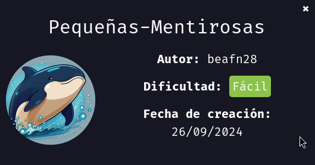

Vamos a realizar la maquina "Pequeñas Mentirosas", como siempre vamos a empezar asignando permisos de ejecución al archivo `auto_deploy.sh` eh inicializamos la maquina con `sudo ./autodeploy ` `pequenas-mentirosas.tar`

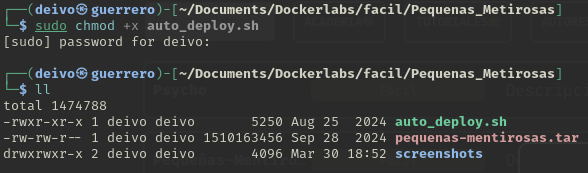

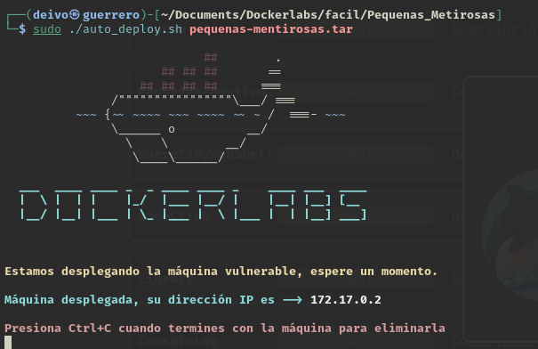

Una vez inicializada la máquina, vamos a realizar un testeo de conexión con el comando `ping`

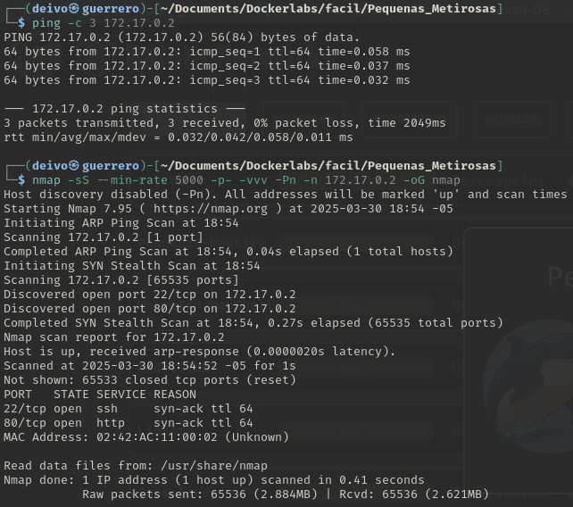

```bash
nmap -sS --min-rate 5000 -p- -vvv -Pn -n 172.17.0.2 -oG nmap
```

- `nmap` → Comando para ejecutar herramienta nmap.
- `-sS` → Escaneo SYN ("Stealth Scan"). Envía paquetes SYN sin completar la conexión TCP (más rápido y sigiloso que -sT).
- `--min-rate 5000` → Fuerza a nmap a enviar al menos 5000 paquetes por segundo, acelerando el escaneo.
- `-p-` → Escanea todos los 65535 puertos (en lugar de solo los más comunes).
- `-vvv` → Modo muy detallado (muestra más información en pantalla mientras se ejecuta).
- `-Pn` → No realiza detección de host (asume que el host está activo y no envía ping previo).
- `-n` → No resuelve nombres de dominio (evita consultas DNS, lo que acelera el escaneo).
- `172.17.0.2` → IP objetivo a escanear.
- `-oG nmap` → Guarda los resultados en formato "greppable" en un archivo llamado nmap.

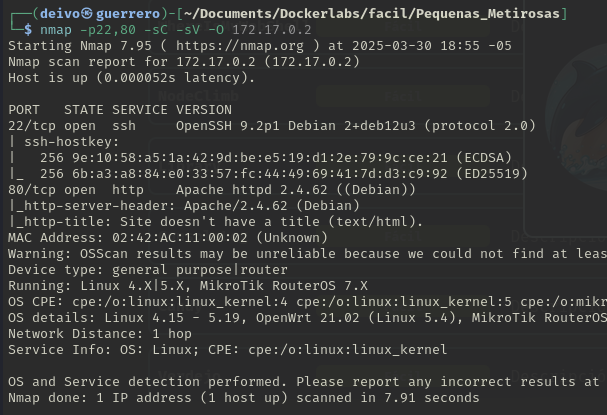


```bash
nmap -p22,80 -sC -sV -O 172.17.0.2
```

`nmap` → Ejecuta la herramienta de escaneo de red Nmap.

`-p22,80` → Especifica los puertos que queremos escanear. En este caso 22 y 80.

`-sC` → Ejecuta scripts de detección predeterminados

`-sV` → Detección de versiones de servicios.

`-O` → Detección del sistema operativo.

`172.17.0.2` → Especifica la dirección IP del objetivo a escanear.

De momento vemos que tiene el puerto 80 abierto, correspondiente a un servidor web, vamos al navegador pasando como ruta la `ip` de la máquina para ver el contenido de esta.

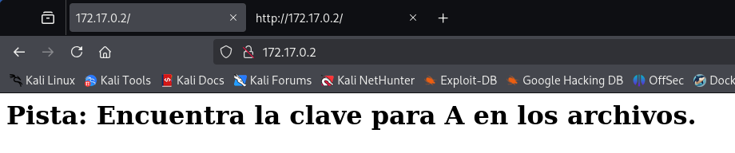

Encontramos un mensaje que dice: "Pista: Encuentra la clave para A en los archivos.".

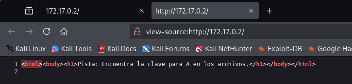

`A` podría hacer referencia a un usuario que se sea a o que empiece con `a`

Intentaremos encontrar la contraseña de `a` con fuerza bruta haciendo uso de la herramienta `hydra`

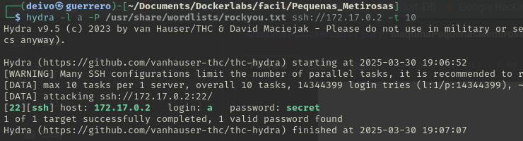

~~~bash
hydra -l a -P /usr/share/wordlists/rockyou.txt ssh://127.17.0.2 -t 10
~~~

|Comando|Significado|
|-------|-----------|
|`hydra`|Herramienta de fuerza bruta para servicios de red.|
|`-l a` |Indica el nombre de usuario a probar: `a`|
|`-P /usr/share/wordlists/rockyou.txt`|Especifica la lista de contraseñas (rockyou.txt) que se probarán una por una.|
|`ssh://127.17.0.2`|Especifica el protocolo y la dirección IP del objetivo, en este caso un servicio SSH corriendo en la IP 127.17.0.2.|
|`-t 10`|Ejecuta hasta 10 hilos (threads) simultáneamente, lo que acelera el proceso de prueba de contraseñas.|

Encontramos que la contraseña del usuario `a` es `secret`, accederemos como el usuario `a` y listaremos sus permisos.

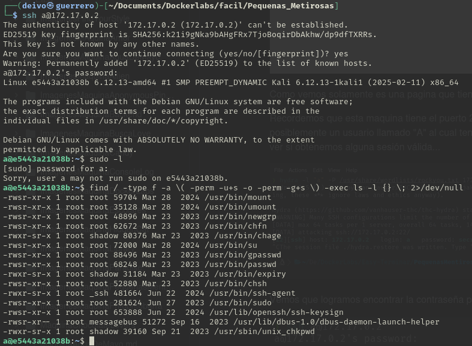

Observamos que nos tenemos permisos para explotar con este usuario, revisemos el archivo `/etc/passwd` para identificar otro usuario.

~~~bash
cat /etc/passwd | grep "sh$"
~~~

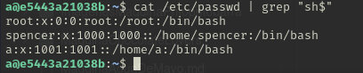

Encontramos que también existe un usuario llamado `spencer`, volveremos a realizar un ataque de fuerza bruta a este usuario para identificar si posee una contraseña débil.

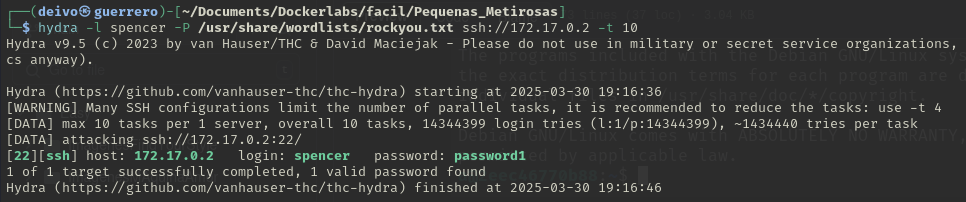

El usuario `spencer` posee la contraseña `password1`.
Nos logearemos como este usuario y revisar que permisos posee.

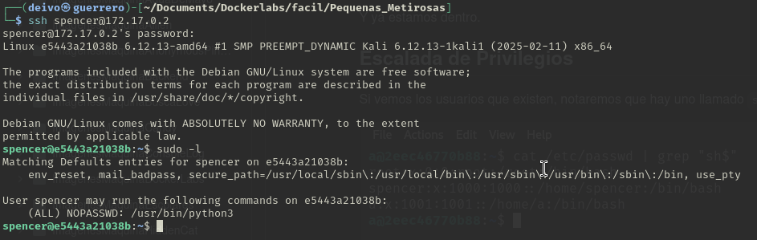

Encontramos que el usuario `spencer` puede usar el binario `/usr/bin/python3` con altos privilegios.

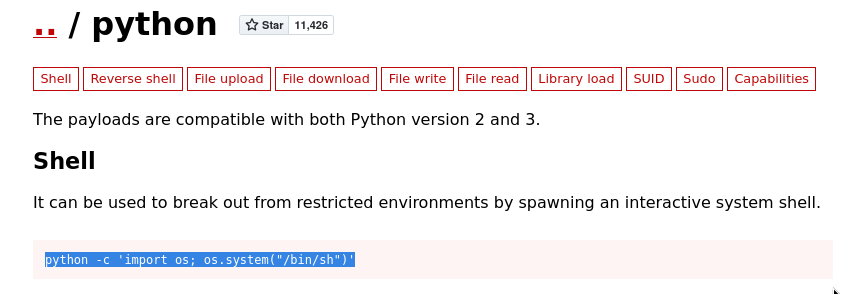

En [GTFOBins](https://gtfobins.github.io/) realizamos las búsqueda de un revert shell con python.
Encontramos el siguiente:
~~~bash
python -c 'import os; os.system("/bin/sh")'
~~~

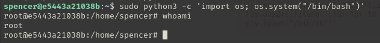

Ejecutaremos el comando anterior pero con algunos ajustes.
~~~bash
sudo python3 -c 'import os; os.system("/bin/bash")'
~~~
Agregamos `sudo` para que se ejecute con altos privilegios.
Además en vez de usar `/bin/sh` usamos `/bin/bash` por preferencia de SHELL.

Ejecutando el comando observamos que ahora somos usuario `root`