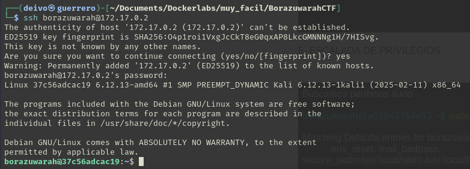

### Informe de maquina *"FBorazuwarahCTF"*


Iniciamos nuestra maquina como es costumbre ya asignando los permisos de ejecución al archivo `auto_deploy.sh` y ejecutando este scrit junto con el archivo de la maquina .tar

```bash
sudo auto_deply.sh borazuwarachcft.tar
```


Realizamos un escaneo de puertos con el comando `nmap`


Se encuentran abiertos los puertos `22` y `80`, realizamos un escaneo más detallado de ambos.


Encontramos que el puerto `22` tiene una versión OpenSSH 9.2 y el puerto `80`tiene una versión Apache https 2.4.59
Pero antes de buscar vulnerabilidades, investiguemos un poco que nos trae de inicio su servidor web.


Encontramos una imagen de 'Kinder Sorpresa', sin mucha información de  momento.

Procedemos a descargar la imagen con el comando `wget` y la ruta de la imagen.


Revisamos los metadatos de la imagen con el comando `exiftool` y la imagen


Observamos que en el atributo "Description" encontramos asignado el valor: ---------- User: `borazuwarah` ----------.
Y en el atributo "Title" el valor ---------- Password: ----------

Teniendo en cuenta que `borazuwarah` es un posible usuario, realizamos un intento de acceso con fuerza bruta haciendo uso de la herramienta `hydra`

```bash
hydra -l borazuwarah -P /usr/share/wordlists/rockyou.txt ssh://ip -t 10
```


En efecto se pudo encontrar la contraseña con fuerza bruta correspondiente a: `123456`



Verificamos que podemos acceder y observamos que podemos hacer uso de `/bin/bash` con permisos `sudo` permitiéndonos ser usuario `root`

