### Informe de maquina *"Hedgehog"*

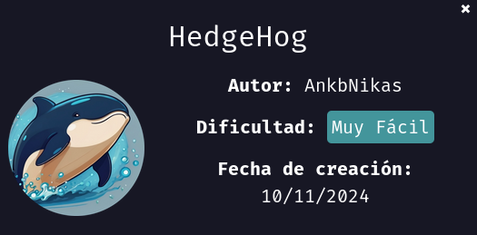

Empezamos nuestra maquina primero dadon permisos de ejecución al archivo `auto_deploy.sh` con `sudo chmod +x`

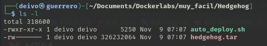

Inicializamos nuestro laboratorio con: `sudo ./auto_deply.sh hedgehog.tar`

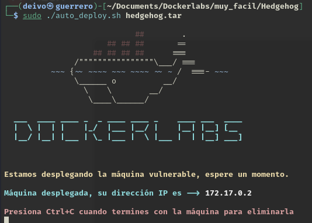

Realizamos un escaneo de puertos con la herramienta `nmap`

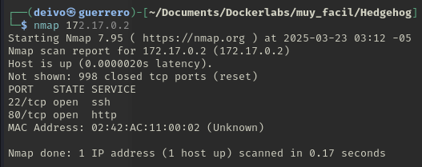

Se identifican abiertos los puertos `22` y `80`, se procede a buscar mas detalle de los mismos con la herramienta `nmap`

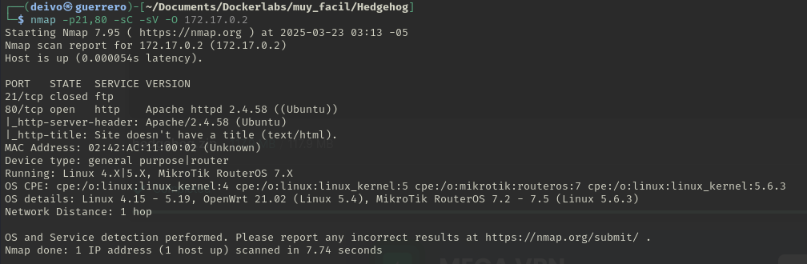

Visualizamos que nos aparece en el navegador, solo encontramos un texto con `tails`

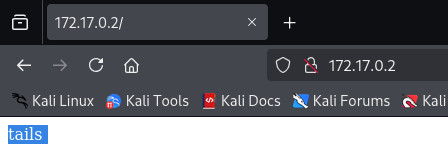
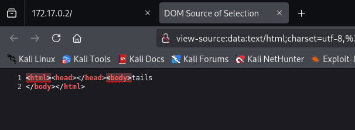

Realizamos un fuzzing de la página en busqueda de otros archivos o directorios.

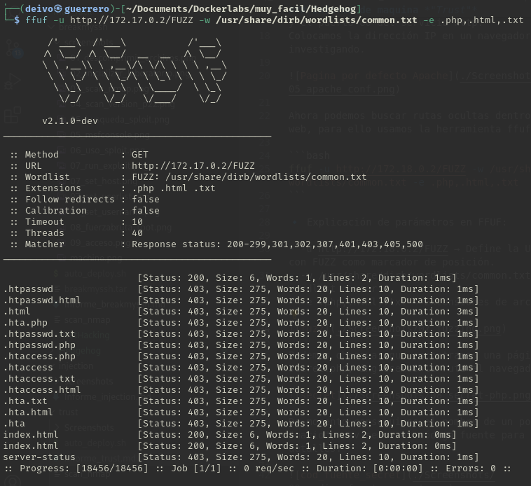

Siguiendo la documentación de otros usuarios nos sugieren realizar un reverse del diccionario rockyou para ahorrar tiempo en encontrar la contraseña de `tails`.

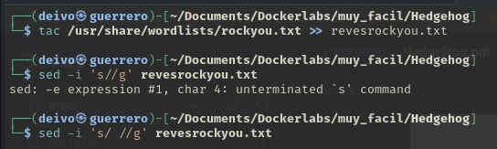

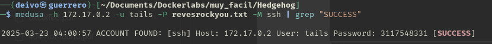

Se encentra que en efecto existe el usuario `tails` y este posee la contraseña `3117548331`

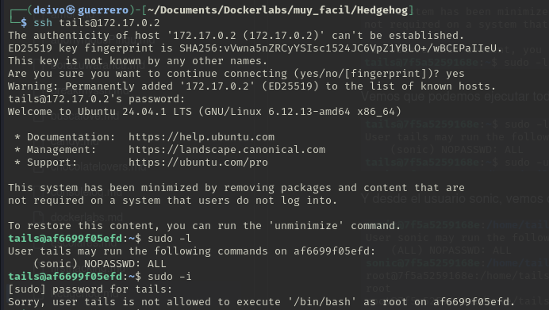

Realizamos una busqeda de permisos sudo con `sudo -l`, encontramos que el usuario "sonic" posee ejecución de altos privilegio sin contraseña

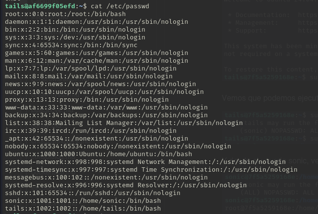.

Intentamos logearnos como el usuario "sonic" con el comando `sudo -u sonic bash` una vez como sonic nos podremos loguear como usuario `root`

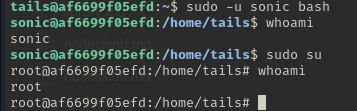
