### Informe de maquina *"breakmyssh"* 

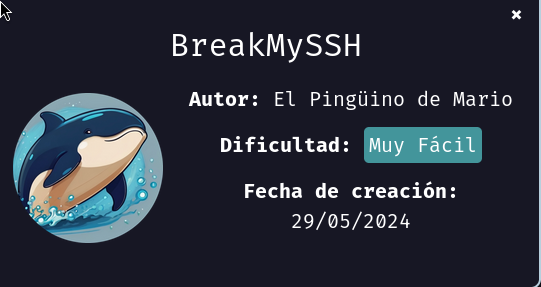

Una vez descargada la maquina y descomprimido el archivo, empezamos por asignar permisos de ejecución al archivo `auto_deploy.sh` e inicializamos la máquina.

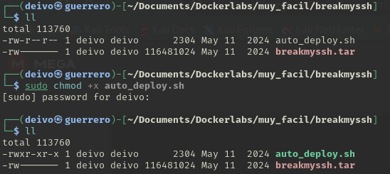

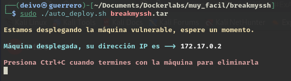

Empezamos por probar la conexión y un escaneo de puertos abiertos.

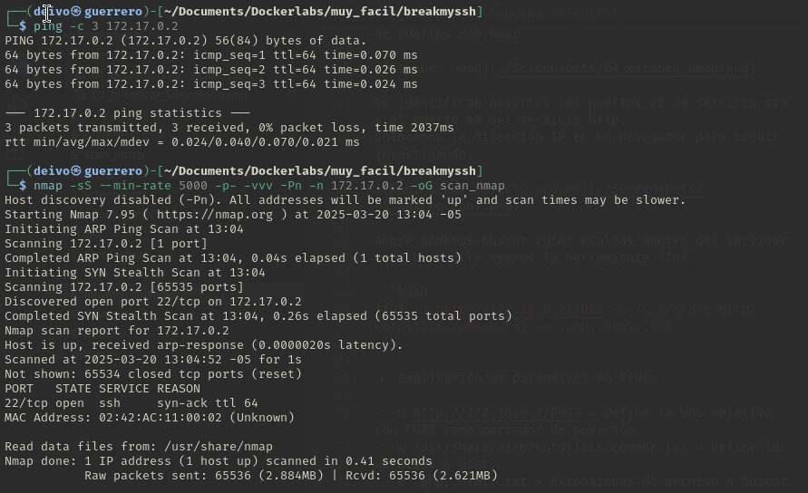

Identificamos que solo encontramos el puerto 22 abierto, ahora realicemos otro escaneo con `nmap` para identificar la versión del servicio activo en ese puerto.

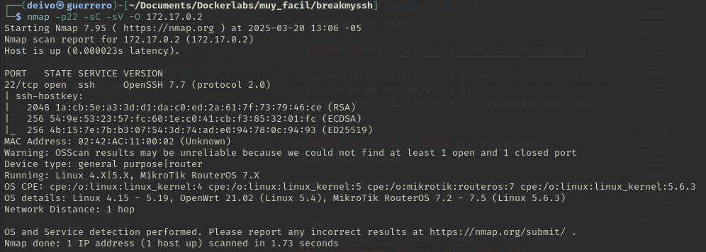

Nos encontramos que tiene activo el servicio de OpenSSH 7.7, vamos a buscar en google si esta versión posee alguna vulnerabilidad que nos podamos aprovechar.

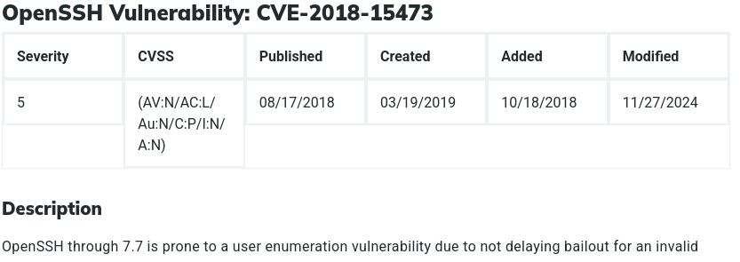

Indagando un poco encontramos que esa versión de OpenSSH es vulnerable a una enumeración de usuarios.

Ahora buscaremos algún sploit similar que podamos usar en la herramienta de Metasploit con el comando `msfconsole`

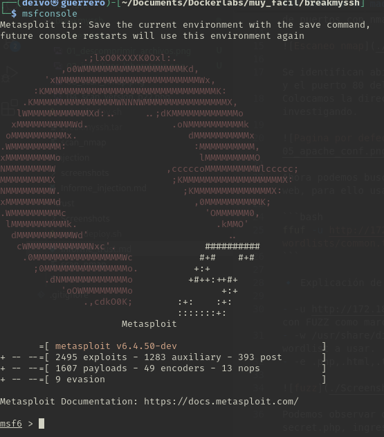

Buscamos exploits para openssh con el comando `search openssh` en el resultado encontramos que el exploit número 3 tiene como descripción "SSH Username Enumeration".

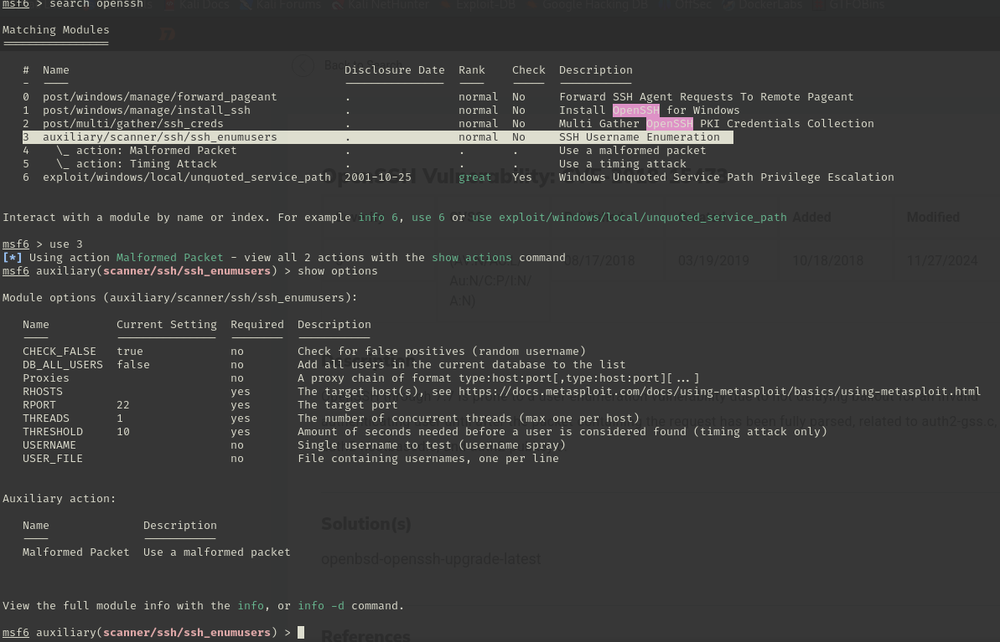

Le decimos a la herramienta que queremos usar ese exploit con el comando `use 3`, y usamos el comando `show optios` para visualizar los parámetros que necesita.

Definimos nuestra maquina victima con el comando `set RHOSTS ip` (remplazando ip por la *ip* de la víctima), el puerto está definido por defecto el 22 por lo tanto no tenemos necesidad de definirlo.

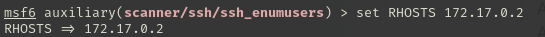

Adicionalmente definiremos un listado de usuarios para la detección usando el comando `set USER_FILE wordlist` (remplazando *worldlist* por la ruta del archivo con la lista de usuarios a comprobar). Para el caso se usó la ruta */usr/share/wordlists/metasploit/namelist.txt*

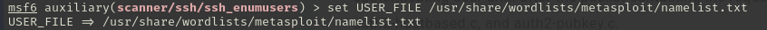

Una vez definidos los parámetros ejecutamos el comando `run` para ejecutar el exploit.

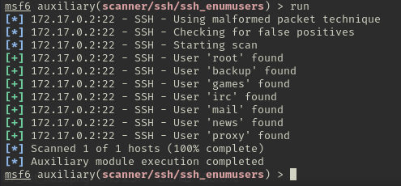

Se ha podido detectar que existen los usuarios root, backup, games, irl, mail, news, proxy.

Ahora podemos ejecutar acceso por ssh con cada uno de los usuarios ejecutando el siguiente comando:

```bash
hydra -l usuario -P /usr/share/wordlists/rockyou.txt ssh://ip -t 10
```

Donde `usuario` lo remplazaremos por cada uno de los usaurios a probar.
`/usr/share/wordlists/rockyou.txt` será la wordlist a utilizar para buscar las contraseñas del usuario
`ip` será la ip víctima para el caso es 172.17.0.2

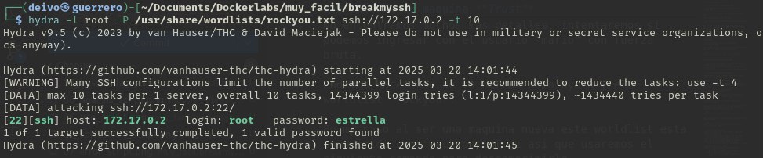

Con fortuna nos ha encontrado la contraseña con el primer usuario testeado `root` además un usuario con altos privilegios.

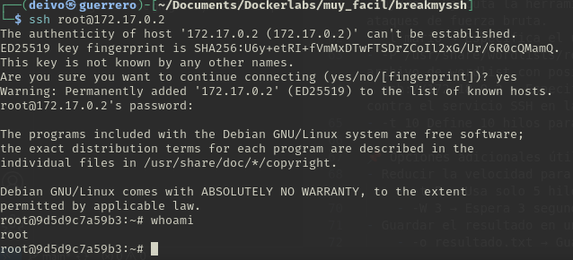

Intentamos el acceso al servidor con éxito.

---

Como recomendaciones para prevenir este tipo de vulnerabilidades:
- Actualizar los servicios que ya se les haya detectado alguna vulnerabilidad como es el caso de OpenSSH 7.7
- Hacer uso de contraseñas fuertes y si se puede apoyar de un doble factor de acceso mucho mejor.