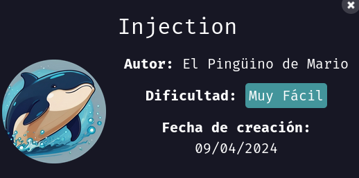
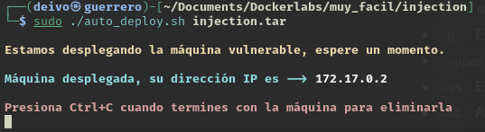
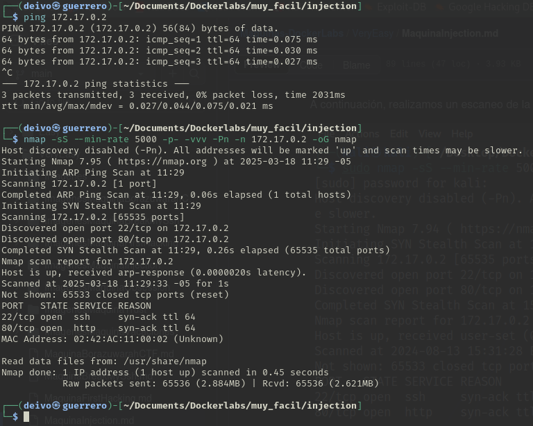
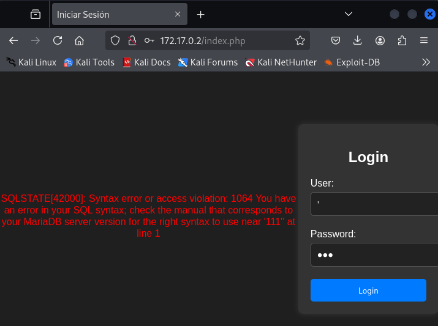
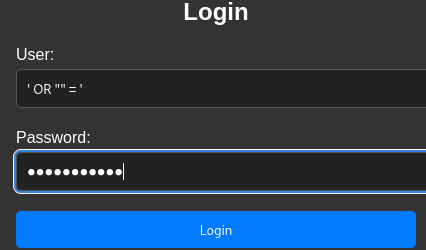
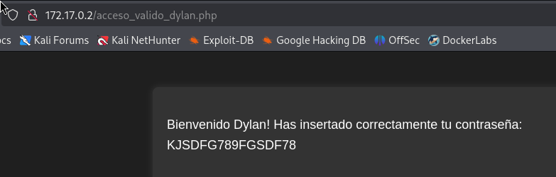
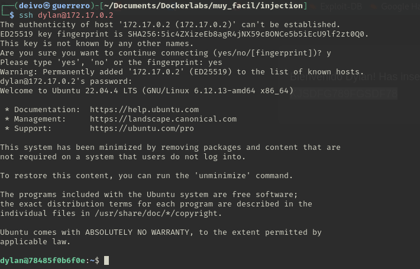
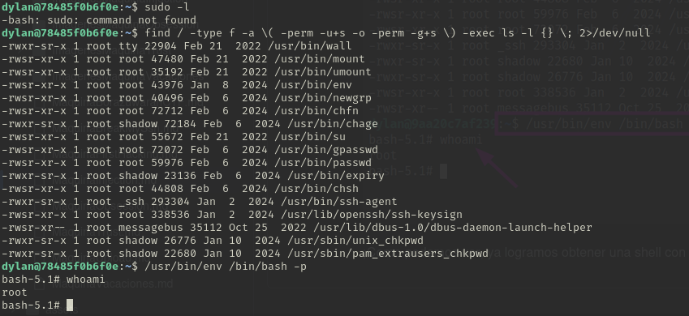
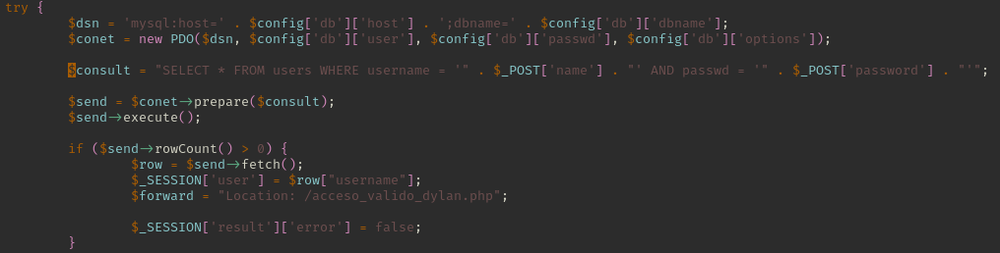

### Informe de maquina *"injection"*



Una vez descarguemos la maquina obtenemos un archivo .zip, que descomprimiremos, en Termina nos ubicaremos en este directorio, encontraremos un archivo .sh y un archivo .tar

Primero le asignamos permisos de ejecución al archivo .sh con el siguiente comando:
```bash
sudo chmod +x auto_deply.sh
```
Ahora inicializamos la maquina con el siguiente comando:
```bash
sudo ./autodeploy.sh
```



Verificamos la conexión con la maquina haciendo uso del comando ping.
De igual forma realizamos un scaneo de puertos con la herramienta nmap

```bash
ping 172.17.0.2
nmap -sS --min-rate 5000 -p- -vvv -Pn -n 172.17.0.2 -oG nmap
```




# Explicación comando nmap #

- nmap → Comando para ejecutar herramienta nmap.
- -sS → Escaneo SYN ("Stealth Scan"). Envía paquetes SYN sin completar la conexión TCP (más rápido y sigiloso que -sT).
- --min-rate 5000 → Fuerza a nmap a enviar al menos 5000 paquetes por segundo, acelerando el escaneo.
- -p- → Escanea todos los 65535 puertos (en lugar de solo los más comunes).
- -vvv → Modo muy detallado (muestra más información en pantalla mientras se ejecuta).
- -Pn → No realiza detección de host (asume que el host está activo y no envía ping previo).
- -n → No resuelve nombres de dominio (evita consultas DNS, lo que acelera el escaneo).
- 172.17.0.2 → IP objetivo a escanear.
- -oG nmap → Guarda los resultados en formato "greppable" en un archivo llamado nmap.


Identificamos que existen 2 puertos abiertos:
- Puerto 22: Asociado al servicio ssh (conexión ssh al servidor)
- Puerto 80: Asociado al servicio http (servicio web)

Empezaremos por revisar que el servicio http colocando la dirección IP en un navegador web.



Encontramos una página llamada "index.php" es una página de login.

Colocando una comilla sencilla (en algunos casos puede ser con comillas dobles, todo depende de la lógica con la que se halla programado la página web) identificamos un error SQL syntax.

Además, también podemos visualizar que usa una base de datos MariaDB

Podemos intentar hacer una Inyección SQL, ingresando en los campos User y Password con alguno de estos ejemplos:

```
' OR 1=1-- -

' OR "" = '
```



Al hacer la inyección SQL nos permite saltarnos el chequeo de credenciales y acceder a la web



Una vez dentro de la web, podemos identificar que un posible usuario del servidor puede llamarse dylan y nos muestra un mensaje con la posible contraseña de este.

Intentamos hacer una conexión ssh al servidor usando el usuario dylan y la contraseña encontrada.



Realizamos un listado de privilegios del usuario, primero con el comando:
```
sudo -l
```
Nos retorna: "-bash: sudo: command not found" es decir que el comando sudo no se encuentra instalado en PATH del sistema.

Vamos a buscar archivos en todo el sistema con permisos SUID o GUID
```
find / -type f -a \( -perm -u+s -o -perm -g+s \) -exec ls -l {} \; 2>/dev/null
```

📌 ¿Qué son los bits SUID y GUID?

SUID (u+s): Si un archivo ejecutable tiene este bit, se ejecutará con los permisos del propietario en lugar de los del usuario que lo ejecuta.
GUID (g+s): Si un archivo ejecutable tiene este bit, se ejecutará con los permisos del grupo en lugar de los del usuario que lo ejecuta.



Entre todos estos binarios haremos uso del binario /usr/bin/env porque nos permite hacer la ejecución de otro binario como /bin/bash y con el flag -p le decimos que lo ejecute manteniendo permisos SUID o GUID, como se puede visualizar lo ejecutamos como usuario root.

---

¿Cómo mitigar este riesgo? Si quieres evitar que esto sea explotable en un sistema real:

Deshabilitar el bit SUID en bash:
```bash
chmod u-s /bin/bash
```

----

¿Como corregir ataque SQL Injection?



🔒 Solución: Cómo corregirlo
✅ Usar consultas preparadas con PDO
```php
$stmt = $pdo->prepare("SELECT * FROM users WHERE username = ? AND passwd = ?");
$stmt->execute([$_POST['name'], $_POST['password']]);
$user = $stmt->fetch();
```
🔹 Esto evita inyecciones SQL porque los valores se pasan como parámetros seguros.

✅ Usar password_hash() y password_verify()
Nunca se debe almacenar contraseñas en texto plano:
```php
$hashed_password = password_hash($_POST['password'], PASSWORD_BCRYPT);
$stmt = $pdo->prepare("INSERT INTO users (username, passwd) VALUES (?, ?)");
$stmt->execute([$_POST['name'], $hashed_password]);
```

Para verificar credenciales:
```php
if (password_verify($_POST['password'], $user['passwd'])) {
    echo "Login exitoso";
} else {
    echo "Credenciales incorrectas";
}
```