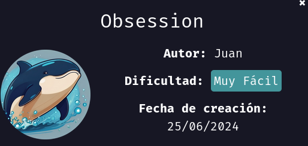

### Informe de maquina *"Obsession"*



Empezamos la maquina asignado permisos de ejecución al archivo `auto_deploy.sh`


Inicializamos nuestra máquina ejecutando el script de `auto_deploy.sh`


Realizamos un escaneo de puertos con la herramienta `nmap`

```bash
nmap -sS --min-rate 5000 -p- -vvv -Pn -n 172.17.0.2 -oG nmap
```

`nmap` → Ejecuta la herramienta de escaneo de red Nmap.

`-sS` → Realiza un escaneo SYN (también llamado half-open scan), que es rápido y sigiloso porque no completa la conexión TCP.

`--min-rate 5000` → Fuerza a Nmap a enviar al menos 5000 paquetes por segundo, aumentando la velocidad del escaneo.

`-p-` → Escanea todos los puertos (del 1 al 65535) en lugar de solo los más comunes.

`-vvv` → Activa el modo muy detallado (verbose), proporcionando más información sobre el escaneo en tiempo real.

`-Pn` → No realiza detección de hosts (omite el ping scan), asumiendo que la IP está activa.

`-n` → No realiza resolución de nombres DNS, lo que hace el escaneo más rápido.

`172.17.0.2` → Especifica la dirección IP del objetivo a escanear.

`-oG nmap` → Guarda la salida en formato grepable (fácil de procesar con scripts) en un archivo llamado nmap.


Encontramos que la maquina tiene abiertos los puertos 21 y 80, vamos a escanear más a detalle estos puertos

```bash
nmap -p21,22,80 -sC -sV -O 172.17.0.2
```

`nmap` → Ejecuta la herramienta de escaneo de red Nmap.

`-p21,80` → Especifica los puertos que queremos escanear. En este caso 21 y 80.

`-sC` → Ejecuta scripts de detección predeterminados

`-sV` → Detección de versiones de servicios.

`-O` → Detección del sistema operativo.

`172.17.0.2` → Especifica la dirección IP del objetivo a escanear.


Para empezar, podemos revisar que encontramos en su servidor web.


Encontramos un comentario que nos da la pista que siempre usa el mismo usuario para todos sus servicios.

Avanzamos con un ataque de fuzzing para ver si encontramos más información.


Encontramos dos directorios ocultos "backup" y "important", vamos a consultarlos para ver si encontramos más información.

```bash
ffuf -u http://172.17.0.2/FUZZ -w /usr/share/dirb/wordlists/common.txt -e .php,.html,.txt
```

`ffuf` Para iniciar la herramienta FFuF (para ataques de fuzzing)

`-u http://172.17.0.2/FUZZ` Para definir la URL donde realizar el ataque, la palabra FUZZ especifica donde ejecutar el ataque.

`-w /usr/share/dirb/wordlists/common.txt` Definimos el diccionario con el cual hacer el fuzzing.

`-e .php,.html,.txt` Le especificamos que buscamos archivos con extensiones .php o .html o .txt


Precisamente en el directorio "backup" encontramos un archivo llamado "backup.txt", en este encontramos que el usuario es: `russoski`

Intentamos realizar un ataque de fuerza bruta con la herramienta `hydra`

```bash
hydra -l russoski -P /usr/share/wordlists/rockyou.txt ssh://172.17.0.2 -t 10
```

`hydra` -> herramienta utilizada para realizar ataques de fuerza bruta.

`-l russoski` -> Especificamos que el usuario es russoski.

`-P /usr/share/wordlists/rockyou.txt` -> Definimos el diccionario con el que realizar el ataque de fuerza bruta.

`ssh://172.17.0.2` -> El ataque se realizará contra el servicio SSH en la IP 172.17.0.2.

`-t 10` -> Cantidad de hilos (threads) que se ejecutarán en paralelo.


Intentamos realizar acceso al servidor.


Listamos los permisos sudo que posee el usuario.


Identificamos que podemos usar el binario `vim` con permisos sudo. Buscaremos como obtener una shell con altos privilegios.

Nos apoyamos de la página [GTFOBins](https://gtfobins.github.io/), buscamos como obtener una shell con `vim`


Ejecutamos el código con permisos `sudo`, también podemos elegir entre una shell `sh` o una `bash` como lo hice en mi caso.


---

Recomendación: Usar contraseñas más fuertes y bloquear el acceso de directorios que no queremos que sean públicos desde internet.