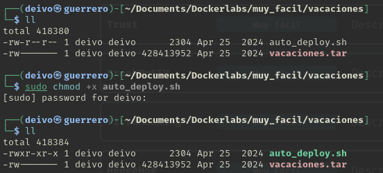
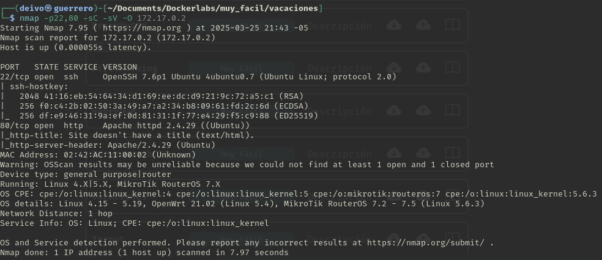
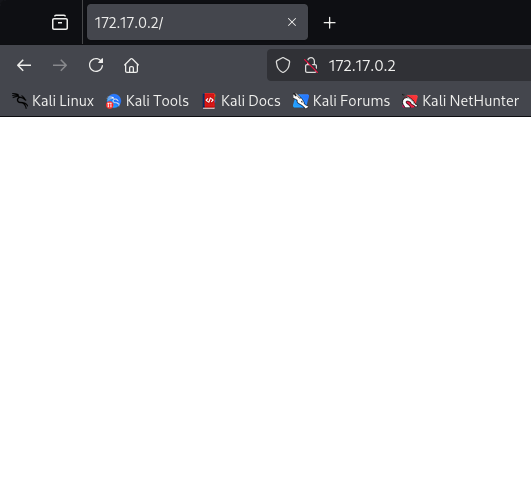
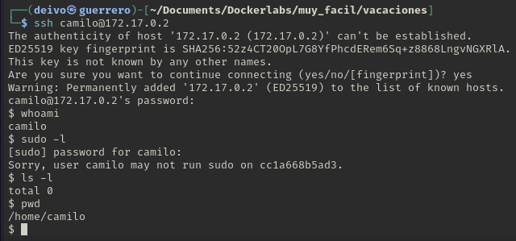
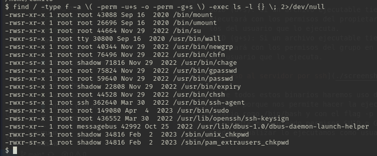
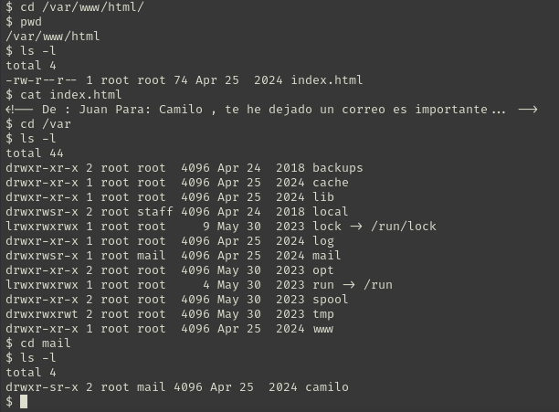
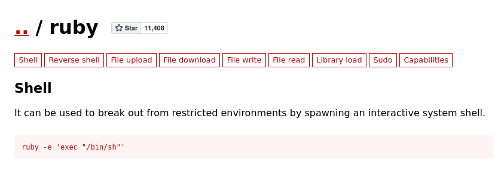

### Informe de maquina *"Vacaciones"*


El día de hoy realizaremos la máquina "Vacaciones", iniciamos nuestra máquina, asignado primero los permisos de ejecución al `archivo auto_deply.sh` ejecutándolo junto con el archivo `.tar` para inicializar la máquina.




Realizamos un escaneo de puertos con la herramienta `nmap`.


Encontramos abiertos los puertos `22` y `80`, realizamos una búsqueda más detallada de estos.



Revisamos que podemos encontrar en la página web.



Revisando el código fuente de la página web encontramos 2 posibles usuarios "juan" y "camilo"


Realizamos una búsqueda de otros archivos o directorios que podamos navegar, no encontramos nada más.


Abrimos MetaSploit en búsqueda de algún exploit para la versión de ssh


Intentaremos ejecutar una enumeración de usuarios para comprobar los usuarios "juan" y "camilo" y si encontramos más


Al parecer nos bloquea el servidor y no nos permite realizar la enumeración de usuarios.

Intentaremos buscar la contraseña de los usuarios "juan" y "camilo" por fuerza bruta.


Al ver que la fuerza bruta del usuario "juan" tarda mucho, se cancela el ataque y se intenta con el usuario "camilo"


Se ha encontrado la contraseña del usuario `camilo` es `pasword1`



Accedemos como el usuario `camilo` y realizamos un listado de los permisos que posee: encontramos que este usuario no puede ejecutar comando `sudo`, realizamos un listado de binarios que podamos usar con altos privilegios.



Se encuentra binario `/usr/bin/chfn`se intenta realizar la ejecución de consola con este binario, pero sin éxito, antes de seguir intentado con este binario u otros, se decide recapitular de la información encontrada hasta el momento.



Dentro del index.html correspondiente al código fuente de la página recordamos que el comentario habla de un correo en particular.


En efecto en el servidor dentro del directorio `/var/mail` se encontraba un directorio llamado `camilo` y dentro de este un archivo llamado `correo.txt`, revisando el contenido de este, encontramos una posible contraseña.


En efecto la contraseña pertenecía al usuario de `juan`, así que accedemos como este usuario y vemos que puede ejecutar el comando `ruby` col altos privilegios.



Realizamos una búsqueda en [GTFobins](https://gtfobins.github.io/) para ejecutar una shell con el comando `ruby`

Ejecutamos el comando: 

```bash
sudo ruby -e 'exec "/bin/sh"'
```

De esa forma ejecutando `whoami` logramos ver que pudimos acceder como usuario `root`

