### Informe de máquina *"CosoleLog"*

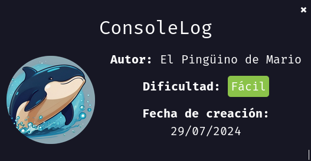

Vamos a realizar la maquina "CosoleLog", como siempre vamos a empezar asignando permisos de ejecución al archivo `auto_deploy.sh` eh inicializamos la maquina con `sudo ./autodeploy ` `consolelog.tar`

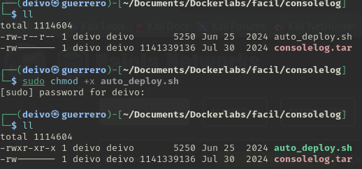
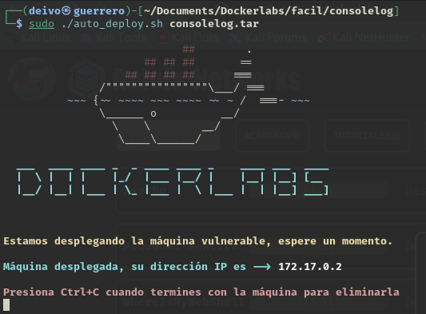

Realizamos un testeo de conexión con el comando `ping`.

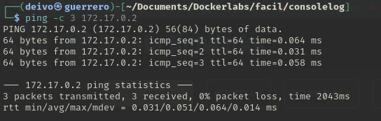

Y realizamos un escaneo de puertos abiertos con la herramienta `nmap`, el comando usado fue:

```bash
nmap -sS --min-rate 5000 -p- -vvv -Pn -n 172.17.0.2 -oG nmap
```

- `nmap` → Comando para ejecutar herramienta nmap.
- `-sS` → Escaneo SYN ("Stealth Scan"). Envía paquetes SYN sin completar la conexión TCP (más rápido y sigiloso que -sT).
- `--min-rate 5000` → Fuerza a nmap a enviar al menos 5000 paquetes por segundo, acelerando el escaneo.
- `-p-` → Escanea todos los 65535 puertos (en lugar de solo los más comunes).
- `-vvv` → Modo muy detallado (muestra más información en pantalla mientras se ejecuta).
- `-Pn` → No realiza detección de host (asume que el host está activo y no envía ping previo).
- `-n` → No resuelve nombres de dominio (evita consultas DNS, lo que acelera el escaneo).
- `172.17.0.2` → IP objetivo a escanear.
- `-oG nmap` → Guarda los resultados en formato "greppable" en un archivo llamado nmap.

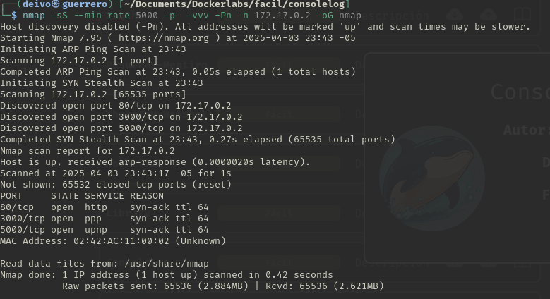

Encontramos los puertos `80`, `3000` y `5000` abiertos, procedemos a realizar un escaneo más detallada de estos.

```bash
nmap -p80,3000,5000 -sC -sV -O 172.17.0.2
```

- `nmap` → Ejecuta la herramienta de escaneo de red Nmap.

- `-p80,3000,5000` → Especifica los puertos que queremos escanear. En este caso 80, 3000 y 5000.

- `-sC` → Ejecuta scripts de detección predeterminados

- `-sV` → Detección de versiones de servicios.

- `-O` → Detección del sistema operativo.

- `172.17.0.2` → Especifica la dirección IP del objetivo a escanear.

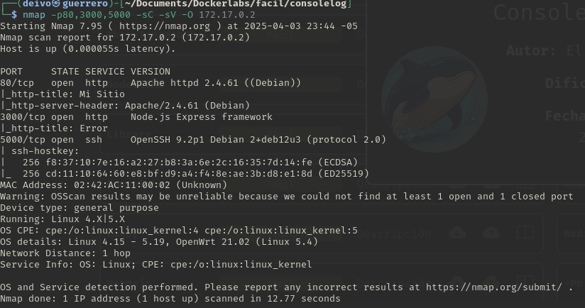

Continuamos a revisar que encontramos en la página web de inicio.

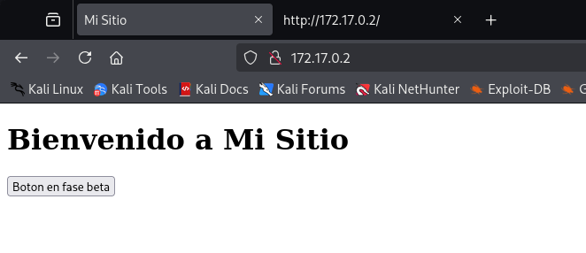

Encontramos una página con un botón que dice: "Boton en fase beta", revisemos el código fuente.


Observamos que hay un Script con dirección a `authentication.js`, revisemos el contenido del mismo.

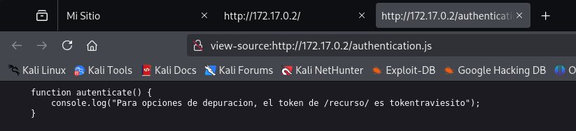

En esta función encontramos un console.log que dice que el token del /recurso/ es `tokentraviesito`

Se decide realizar un ataque de Fuzzing a servidor web en busqueda de otros archivos o directorios.

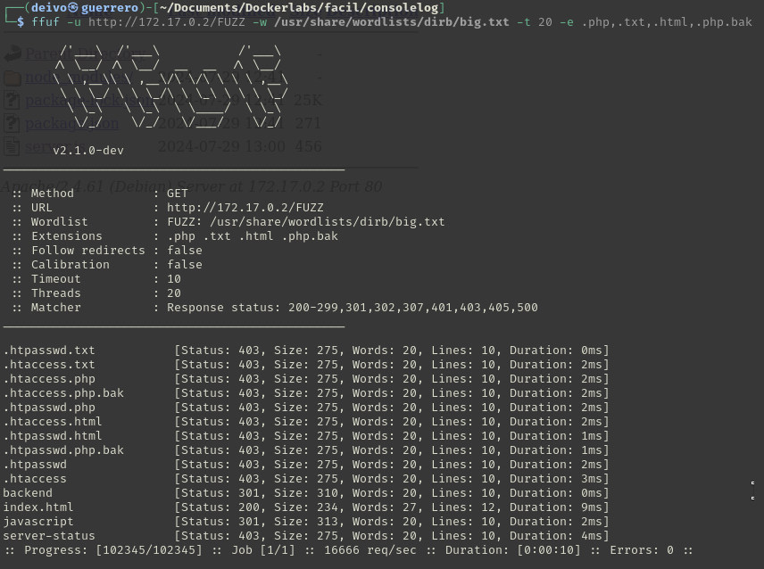

Encontramos un directorio llamado "backend".

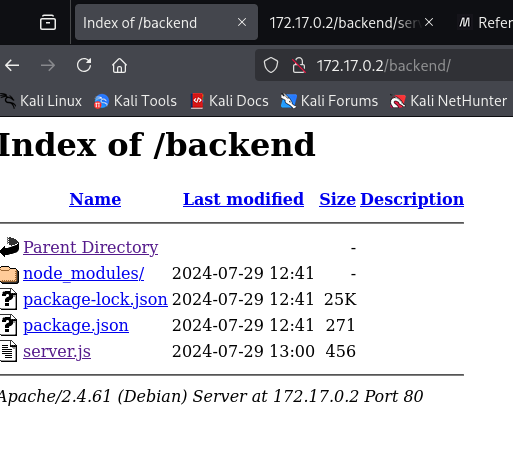

Nos llama la atención el archivo server.js.
Abriendo el contenido del mismo encontramos una función, que obteniendo el token identificado anteriormente retornará una página con el texto: `lapassworddebackupmaschingonadetodas`

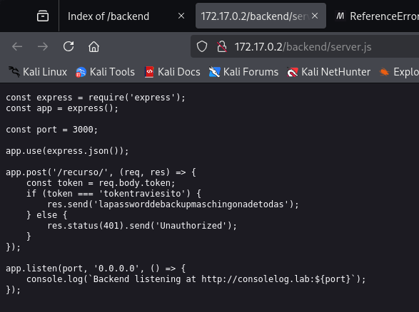

Asumimos que es la contraseña de algun usuario, realizamos un ataque de fuerza bruta con la herramienta `hydra` seteando el puerto 5000

```bash
hydra -L /usr/share/wordlists/john.lst -p "lapassworddebackupmaschingonadetodas" -s 5000 ssh://172.17.0.2 -t 10
```

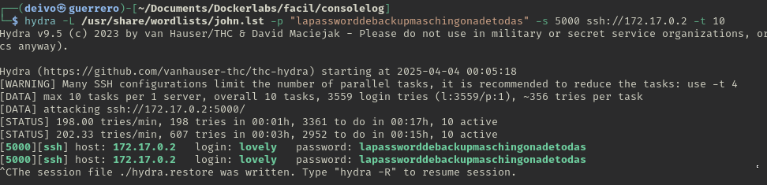

Como resultado encontramos al usuario `lovely`, accedemos con el mismo y revisamos los permisos sudo de ejecución.

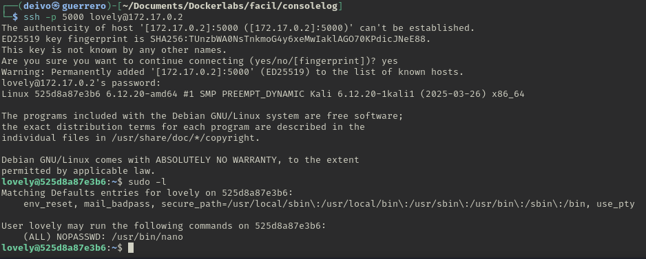

Encontramos que puede ejecutar con permisos `sudo` el comando `nano` procedemos a buscar como ejecutar una shell con este comando en [GTFOBins](https://gtfobins.github.io/)

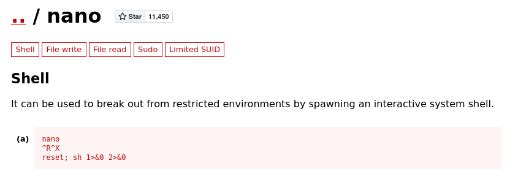

1. Ejecutamos `sudo nano`
2. Una vez en el editor presionamos `Ctrl + R`
3. Luego presionamos `Ctrl + X`
4. Nos pedira que ejecutemos un comando, escribimos `reset; sh 1>&0 2>&0` y damos Enter.
5. Ejecutamos comando `whoami` para comprobar que somos usuarios `root`

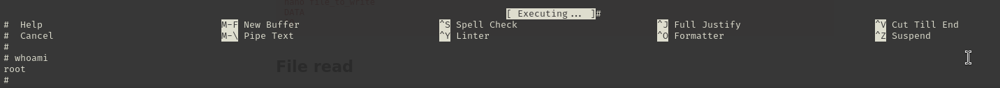
