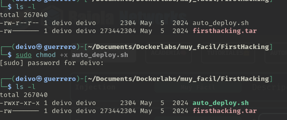
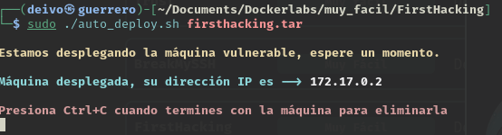
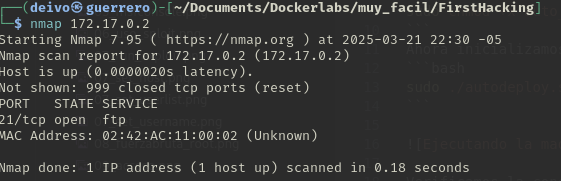
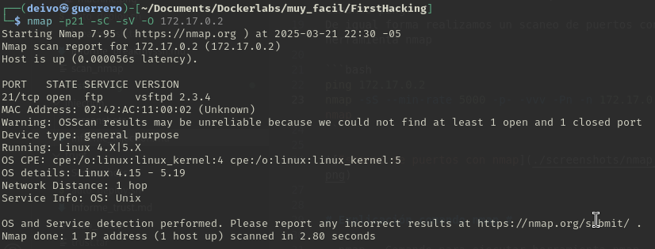
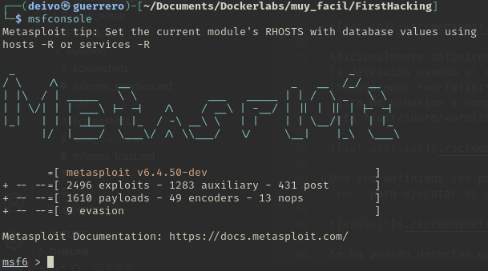
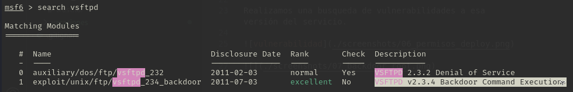
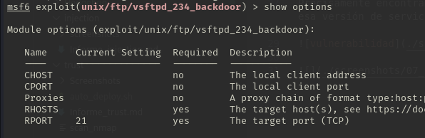
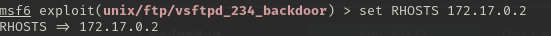
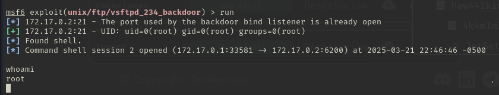

### Informe de maquina *"FirstHacking"*

Empezamos asignando permisos de ejecución a `auto_deploy.sh` con `sudo chmod +x`

Inicializamos el laboratorio `sudo ./auto_deploy.sh` *nombre maquina*

Realizamos un escaneo de puertos abiertos con el comando `nmap`

Se identifíca solo el puerto 21 abierto correspondiente a un servicio ftp.

Se identifica que el servicio ftp tiene una versión `vsftpd 2.3.4`

Realizamos una busqueda de vulnerabilidades a esa versión del servicio.

Precisamente encontramos un exploit de Backdoor para esa versión de servicio, lo seleccionamos.

Con el comando `show options` podemos observar que configuraciones podemos hacer para iniciar el exploit.

Observamos que el puerto esta definido por defecto al puerto 21, por lo tanto no tenemos que configurarlo.

Pero si debemos definir la IP de la victima con el comando `set RHOSTS ip` ip correspondiendo a: `172.17.0.2`

Una vez configurado el exploit, lo ejecutamos con el comando `run`.

Ejecutando el comando `whoami` podemos obaservar que nos ha iniciado una terminal de session como `root`

