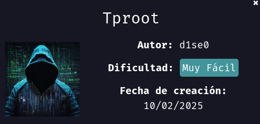
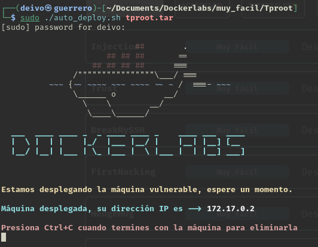
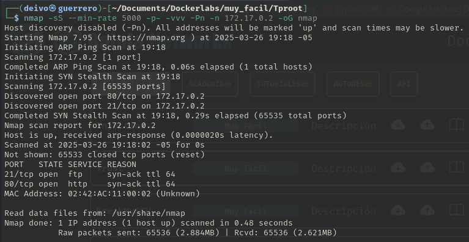
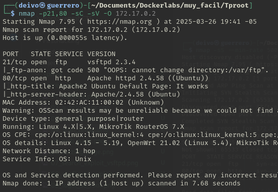
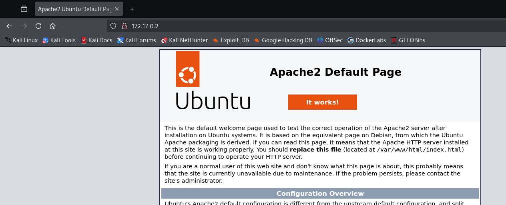
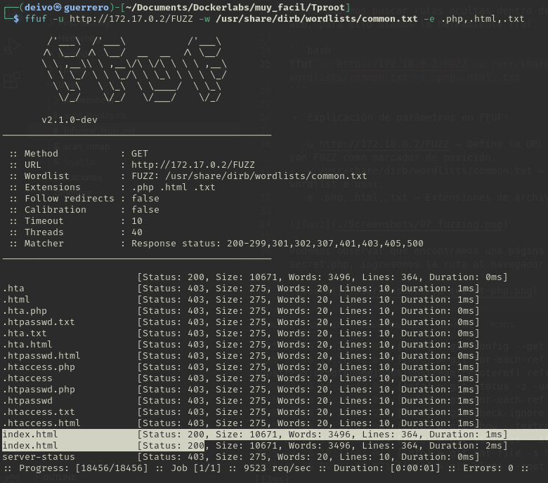
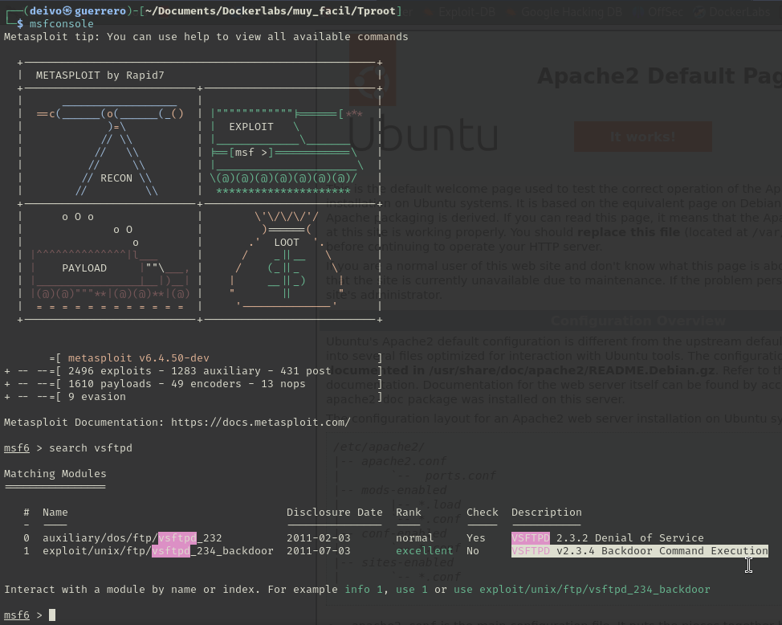
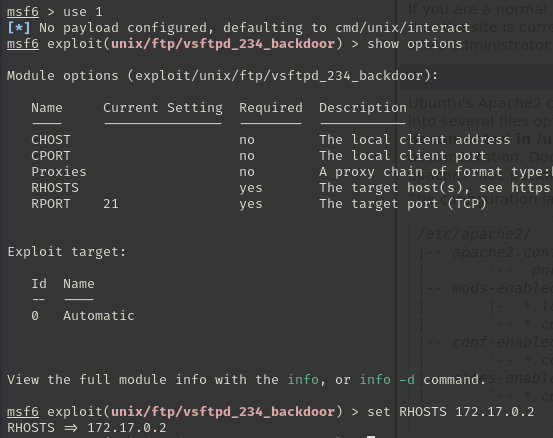
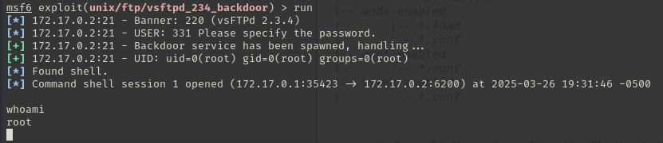

### Informe de maquina *"Tproot"*



Inicializamos nuestra máquina ejecutando el script de `auto_deploy`



Realizamos un escaneo de puertos con la herramienta `nmap`

```bash
nmap -sS --min-rate 5000 -p- -vvv -Pn -n 172.17.0.2 -oG nmap
```

`nmap` → Ejecuta la herramienta de escaneo de red Nmap.

`-sS` → Realiza un escaneo SYN (también llamado half-open scan), que es rápido y sigiloso porque no completa la conexión TCP.

`--min-rate 5000` → Fuerza a Nmap a enviar al menos 5000 paquetes por segundo, aumentando la velocidad del escaneo.

`-p-` → Escanea todos los puertos (del 1 al 65535) en lugar de solo los más comunes.

`-vvv` → Activa el modo muy detallado (verbose), proporcionando más información sobre el escaneo en tiempo real.

`-Pn` → No realiza detección de hosts (omite el ping scan), asumiendo que la IP está activa.

`-n` → No realiza resolución de nombres DNS, lo que hace el escaneo más rápido.

`172.17.0.2` → Especifica la dirección IP del objetivo a escanear.

`-oG nmap` → Guarda la salida en formato grepable (fácil de procesar con scripts) en un archivo llamado nmap.



Encontramos que la maquina tiene abiertos los puertos 21 y 80, vamos a escanear más a detalle estos puertos

```bash
nmap -p21,80 -sC -sV -O 172.17.0.2
```

`nmap` → Ejecuta la herramienta de escaneo de red Nmap.

`-p21,80` → Especifica los puertos que queremos escanear. En este caso 21 y 80.

`-sC` → Ejecuta scripts de detección predeterminados

`-sV` → Detección de versiones de servicios.

`-O` → Detección del sistema operativo.

`172.17.0.2` → Especifica la dirección IP del objetivo a escanear.



Encontramos que el servicio ftp posee una versión `vsftpd 2.3.4`, antes de intentar un ataque a este servicio, revisemos un poco la el servicio web.



No encontramos mucha información, solo una pagina de inicio de servidor Apache.
Realizamos un ataque de fuzziin por si encontramos más archivos.

```bash
ffuf -u http://172.17.0.2/FUZZ -w /usr/share/dirb/wordlists/common.txt -e .php,.html,.txt
```

`ffuf` Para iniciar la herramienta FFuF (para ataques de fuzzing)

`-u http://172.17.0.2/FUZZ` Para definir la URL donde realizar el ataque, la palabra FUZZ especifica donde ejecutar el ataque.

`-w /usr/share/dirb/wordlists/common.txt` Definimos el diccionario con el cual hacer el fuzzing.

`-e .php,.html,.txt` Le especificamos que buscamos archivos con exteciones .php o .html o .txt



No encontramos mucho así que procedemos a buscar un explot de la version del servicio de ftp. Abrimos Metasploit y ejecutamos el comando `search vsftpd`



En efecto encontramos un exploit de backdoor, lo seleccionamos con `use 1` podemos ver las configuraciones del exploit con `show options`. Para este caso solo necesitamos configurar la ip victima, la definimos con `set RHOST 172.17.0.2`



Una vez configurado el exploit, lo ejecutamos con el comando `run`.



Observamos que nos habilita una consola donde si ejecutamos el comando `whoami` nos informa que estamos logueados como usuarios `root`

